# Browser Automation SaaS — Complete Project Architecture

Phase 23 adds protected health/readiness, Prometheus-compatible bounded
metrics, structured operational logging, component heartbeats, and an
INTERNAL-only operations view. See `OBSERVABILITY.md` for definitions and
access policy.

Phase 22 formalizes horizontally scalable browser execution: restart-unique
worker identity, durable operational health, bounded process concurrency,
database-authoritative claims, graceful draining, and lease-aware recovery.
See `WORKER_SCALING.md` for the production process and recovery contract.

Phase 14 adds customer outbound webhooks as a distinct PostgreSQL-authoritative
event/delivery subsystem with its own BullMQ worker, encrypted signing secrets,
SSRF validation, retries, replay, reconciliation, and account-deletion boundary.
See `OUTBOUND_WEBHOOKS.md` for the wire and operational contract.

## 1. Document Purpose

This document maps the repository as inspected through 2026-07-25. It describes the
implemented system, its runtime connections, and its known limits. Proposed
architecture is isolated in Sections 11, 15, 31, and 32 and is not presented as
current behavior.

Status vocabulary:

- ✅ **VERIFIED**: inspected and demonstrated by a safe check or prior recorded
  end-to-end verification in this worktree.
- 🟡 **PRESENT BUT UNVERIFIED**: implemented and connected, but not executed
  during this documentation task.
- 🟠 **PARTIAL**: connected, but important behavior, persistence, or failure
  handling is incomplete.
- 🔴 **MISSING OR BROKEN**: absent, disconnected, or known to fail.

These statuses distinguish file existence, imports, runtime wiring, compilation,
executed behavior, failure handling, and production readiness.

## 2. Executive Summary

The repository combines two independently built systems:

1. A root TypeScript browser automation engine in `src/`, compiled to `dist/`.
   It provides an `Agent`, LLM adapters, `BrowserSession`, `BrowserProfile`,
   Playwright/Chromium control, DOM services, tools, an `EventBus`, a CLI, and
   extensive unit tests.
2. A Next.js App Router SaaS dashboard in `dashboard/`. It provides Better Auth
   authentication, PostgreSQL persistence through Prisma, user-owned agents,
   durable queued run submission, a standalone worker, run history, event
   timelines, and a React UI.

The dashboard does not duplicate the engine. At runtime, its `EngineLoader`
locates and dynamically imports selected compiled modules from root `dist/`.
Execution does not occur inside the HTTP request. A database transaction takes
a per-user advisory lock, enforces the user's active-run limit, creates one
`QUEUED` row, and submits a BullMQ job containing only a version and Run ID.
A standalone worker loads trusted data from PostgreSQL, takes a database lease,
heartbeats, creates Groq and browser objects, runs `Agent.run(maxSteps)` behind
a 5-second to 15-minute wall-clock deadline, and persists the guarded terminal
state, ordered events, and artifact metadata. A partial unique index permits
only one `QUEUED` or `RUNNING` row per agent.

Operational email uses a separate durable pipeline: PostgreSQL notification and
delivery records are authoritative, while a dedicated BullMQ queue and
standalone notification worker perform asynchronous delivery. Authoritative
Run, scheduling, usage, billing, and account-deletion transitions create
idempotent events; the browser execution queue remains unchanged. See
`docs/NOTIFICATIONS.md` for the current policy and commands.

First-run onboarding and starter templates are also dashboard-only layers over
the existing Agent and Run boundaries. The source-controlled catalogue supplies
safe, plan-clamped defaults; applying a template creates an ordinary Agent and
optional create-and-test uses normal admission and BullMQ execution. Durable UI
state is stored separately while checklist milestones remain owner-scoped facts
derived from product records. See `docs/ONBOARDING_AND_TEMPLATES.md`.

Reusable Agent variables extend the same boundary. Definitions belong to the
Agent, while admission resolves and stores an immutable Run execution snapshot;
the minimal queue payload and worker retry path remain unchanged. Schedules keep
their own validated non-secret values and are safely paused when definition
edits invalidate them. Secret execution is deferred until an encrypted
credential channel exists. See `docs/AGENT_VARIABLES.md`.

Authentication and `Run.result` handling are the strongest recently stabilized
paths. Authentication was previously demonstrated end to end on
`http://localhost:3001`, with strict origin validation retained. JSON result
formatting has focused tests covering legacy and unexpected shapes.

Phase 3A added durable local observability: bounded structured events,
deterministic sequence numbers, screenshot metadata, owner-scoped artifact
routes, run-detail navigation, a visual timeline, and an authenticated gallery.
Phase 3B added bounded single-server execution: hard timeouts, cooperative stop
and browser close, listener cleanup, database-backed duplicate protection,
per-user concurrency admission, guarded terminal transitions, stale-run
recovery, artifact byte limits, and explicit retention maintenance. Phase 4
added BullMQ/Redis delivery, standalone workers, database leases and
heartbeats, retries, backpressure, and reconciliation commands. Phase 5 added
authenticated SSE, sequence-based replay, Redis invalidation with PostgreSQL
fallback, incremental event/artifact persistence, and cooperative queued and
running cancellation. Local artifact storage cannot support horizontal
deployment, so the application remains a controlled local prototype.

## 3. Current Project Status

| Area                         | Status                    | Interpretation                                                                                                                                       |
| ---------------------------- | ------------------------- | ---------------------------------------------------------------------------------------------------------------------------------------------------- |
| Root engine source and tests | ✅ VERIFIED               | Root TypeScript typecheck passes; 147 root test files exist.                                                                                         |
| Compiled root engine         | ✅ VERIFIED               | Required modules exist in ignored `dist/`; dashboard dynamically loads them.                                                                         |
| Dashboard compile and lint   | ✅ VERIFIED               | No-emit TypeScript and dashboard lint pass.                                                                                                          |
| Authentication               | ✅ VERIFIED               | Previously exercised registration, login, refresh, logout, protected routes, and invalid-origin rejection on port 3001.                              |
| Agent CRUD                   | 🟡 PRESENT BUT UNVERIFIED | Routes and UI are connected and ownership-scoped; not exercised in this documentation pass.                                                          |
| Queued execution             | ✅ VERIFIED LOCALLY       | Authenticated `202`, durable Run/job reservation, standalone execution, web restart independence, leases, and forced worker recovery were exercised. |
| Event persistence            | ✅ VERIFIED               | Bounded structured data and unique per-run sequence persist; 43 legacy rows were backfilled.                                                         |
| Screenshot persistence       | ✅ VERIFIED               | PNG metadata and relative storage keys persisted and retrieved in a controlled run.                                                                  |
| Artifact access and timeline | ✅ VERIFIED               | Owner-only list/file APIs, visual timeline, gallery, refresh, logout, and cross-user checks passed.                                                  |
| `Run.result` safety          | ✅ VERIFIED               | Canonical client JSON types, guards, rendering, search, and 14 focused tests pass.                                                                   |
| Execution security boundary  | ✅ VERIFIED               | Route and service ownership checks, safe public errors, redacted logs, and safe failure persistence have focused tests.                              |
| Production deployment        | 🔴 MISSING OR BROKEN      | No verified production topology; current assumptions conflict with ordinary serverless constraints.                                                  |

One disposable three-step `example.com` execution used the configured Groq
provider and local Chromium. Its disposable users, rows, and test artifact were
removed after verification.

## 4. What the Project Can Do Right Now

| Capability                                 | Status                    | Current behavior                                                             | Evidence                                            | Important limitation                          |
| ------------------------------------------ | ------------------------- | ---------------------------------------------------------------------------- | --------------------------------------------------- | --------------------------------------------- |
| Show landing page                          | ✅ VERIFIED               | App Router landing UI with theme support                                     | `src/app/page.tsx`                                  | Static product page                           |
| Register users                             | ✅ VERIFIED               | Better Auth email/password sign-up                                           | Auth route and prior runtime verification           | Email verification disabled                   |
| Log users in                               | ✅ VERIFIED               | Same-origin email/password sign-in                                           | Auth form and prior runtime verification            | No additional MFA                             |
| Persist sessions                           | ✅ VERIFIED               | Database session plus protected cookie                                       | Better Auth config and prior refresh test           | Seven-day session policy                      |
| Protect dashboard routes                   | ✅ VERIFIED               | Server layout calls `requireAuth()`                                          | Dashboard layout inspection and prior redirect test | Individual APIs must still enforce auth       |
| Log users out                              | ✅ VERIFIED               | POST to Better Auth sign-out                                                 | Navbar/mobile flows and prior runtime test          | None observed locally                         |
| Create/list/update/delete agents           | 🟡 PRESENT BUT UNVERIFIED | Authenticated Prisma CRUD                                                    | Agent route handlers and UI fetches                 | No API integration tests                      |
| Edit agents                                | 🟡 PRESENT BUT UNVERIFIED | PATCH endpoint and supported-model update control exist                      | Agent route and detail client                       | Full edit form remains absent                 |
| Run an agent                               | ✅ VERIFIED LOCALLY       | POST returns `202`; worker later executes the same Run                       | Authenticated runtime/restart drill                 | Requires Redis and worker                     |
| Load compiled root engine                  | ✅ VERIFIED LOCALLY       | Worker preflight dynamically imports required root `dist/` modules           | Runtime worker drill and missing-dist test          | Dashboard does not build `dist/`              |
| Launch Chromium                            | ✅ VERIFIED LOCALLY       | Worker-owned `BrowserSession` uses Playwright                                | Authenticated restart drill                         | Deployment host must provide Chromium         |
| Create `BrowserSession` / `BrowserProfile` | ✅ VERIFIED LOCALLY       | Worker constructs root engine classes                                        | Authenticated restart drill                         | Host dependencies remain operational          |
| Create Groq LLM                            | ✅ VERIFIED LOCALLY       | Central policy resolves one account-listed Groq model                        | Account listing and successful worker run           | Groq-only product scope                       |
| Execute `Agent.run()`                      | ✅ VERIFIED LOCALLY       | Worker calls configured max steps behind a hard deadline                     | Successful worker run                               | Provider quota can reject requests            |
| Collect and save events                    | ✅ VERIFIED               | Engine events become bounded sequenced records during execution              | Tests and controlled run                            | Event lists remain unpaginated                |
| Collect/save screenshots                   | ✅ VERIFIED               | Step data URLs, history base64 strings, and history file paths are validated | Tests and controlled PNG                            | Best-effort local storage                     |
| Persist visited URLs and summary           | ✅ VERIFIED               | JSON object `{summary, visitedUrls}` is stored                               | Persistence code and result tests                   | Other execution detail is omitted             |
| Display completed runs                     | ✅ VERIFIED               | Lists safely format all JSON result shapes                                   | Runs UI and focused tests                           | No pagination                                 |
| Display event timelines                    | ✅ VERIFIED               | Sequence, step, action names, URL, status, details, and screenshots render   | Tests and runtime detail API                        | No live progress                              |
| Display screenshots/exact actions          | ✅ VERIFIED               | Authenticated thumbnails and full-size navigation                            | Controlled run and UI tests                         | Action parameters are intentionally discarded |
| Cancel a run                               | ✅ VERIFIED LOCALLY       | Owner-scoped queued/running cancellation reaches one terminal `CANCELED`     | Phase 5 tests and Linux runtime drill               | Stop remains cooperative                      |
| Enforce timeout                            | ✅ VERIFIED               | 5s-15m deadline, cooperative stop, guarded terminal write                    | Phase 3B tests and runtime                          | Process termination remains supervisor-owned  |
| Prevent duplicate runs                     | ✅ VERIFIED               | Partial unique active-agent index plus admission transaction                 | Tests and runtime                                   | No public idempotency key                     |
| Background worker / queue                  | ✅ VERIFIED LOCALLY       | BullMQ/Redis delivery plus standalone leased worker                          | Runtime, crash, retry, and recovery drills          | Production supervision remains                |
| Stream live progress                       | ✅ VERIFIED LOCALLY       | Authenticated SSE streams status, events, and artifact metadata              | Replay/restart/runtime drill                        | Process-local connection limits               |
| Schedule agents                            | 🟠 PARTIAL                | Schedule fields and form values exist                                        | Prisma and create form                              | No scheduler executes them                    |
| Multiple dashboard providers               | 🟠 PARTIAL                | Root supports many providers; dashboard validates Groq                       | Root LLM factory/dashboard schema                   | Intentional current dashboard scope           |
| Teams / billing                            | 🔴 MISSING OR BROKEN      | No models or flows                                                           | Schema and UI inspection                            | Deferred SaaS scope                           |

## 5. Repository Structure

```text
.
├── src/                         # Root automation engine source
│   ├── agent/                   # Agent loop, history, prompts, views
│   ├── browser/                 # Browser profile/session/watchdogs
│   ├── controller/              # Tool/action registry and execution
│   ├── dom/                     # DOM extraction and interaction models
│   ├── llm/                     # Provider adapters and model factory
│   ├── screenshots/             # Root screenshot support
│   ├── event-bus.ts             # Engine event transport
│   ├── index.ts                 # Public engine exports
│   └── cli-entry.ts             # Lazy CLI entry
├── dist/                        # Generated, ignored engine output
├── test/                        # Root engine tests plus result utility test
├── docs/                        # Existing root engine documentation
├── dashboard/
│   ├── prisma/                  # Schema and one initial migration
│   ├── src/app/                 # Pages, layouts, and API route handlers
│   ├── src/components/          # Auth, dashboard, agent, run, and UI components
│   ├── src/lib/auth/            # Better Auth server and session helpers
│   ├── src/lib/browser/         # Dashboard-to-engine integration
│   ├── src/lib/execution/       # Execution facade
│   ├── src/lib/db/prisma.ts     # Prisma singleton
│   ├── src/lib/types.ts         # Browser-safe JSON and API types
│   ├── src/lib/utils/           # Result and presentation helpers
│   └── package.json             # Next.js scripts and dependencies
├── package.json                 # Root engine and delegated dashboard scripts
└── pnpm-lock.yaml               # Root dependency resolution
```

Root and dashboard have separate package manifests and lockfiles rather than a
declared package workspace. Generated `dist/`, `.next/`, local artifact folders,
and environment files are ignored. `dashboard/.env.example` is the safe
configuration template.

## 6. System Context

**Diagram 1 — Current system context**

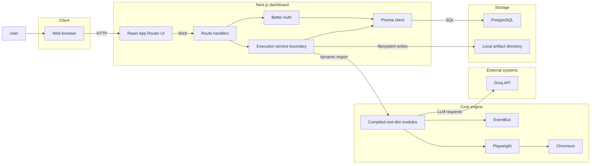

The Next.js server is both web application and execution host. PostgreSQL,
Groq, and Chromium are separate runtime dependencies; local artifacts remain
on the server filesystem.

## 7. High-Level Architecture

**Diagram 2 — Current container architecture**

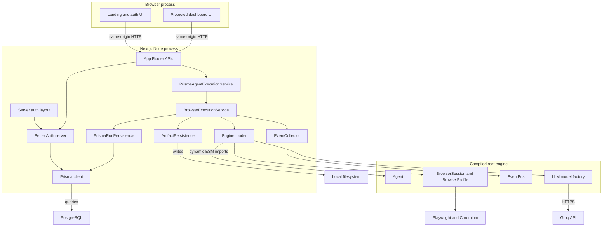

Calls inside the dashboard are ordinary server function calls. The root engine
is not a separate deployed service; it is loaded into the same Node process.

## 8. Root Browser Engine Architecture

**Diagram 3 — Root engine modules**

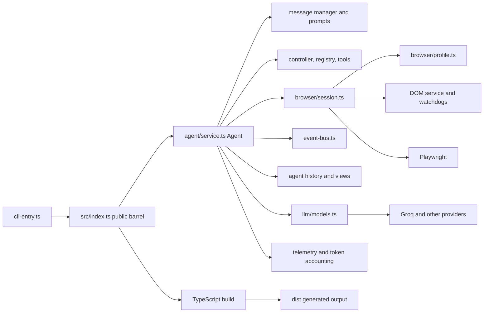

`Agent.run()` owns the step loop, emits task/step/update events, invokes the LLM
and tools, and starts and closes the browser session. `BrowserSession` owns
Playwright lifecycle and watchdogs. `EventBus` dispatches typed engine events
and records dispatch results. The engine supports many LLM providers; the
dashboard currently selects only Groq.

`dist/` is generated and ignored by Git. The dashboard requires its compiled
files at runtime, but dashboard startup does not build them.

## 9. Next.js Dashboard Architecture

**Diagram 4 — Dashboard layers**

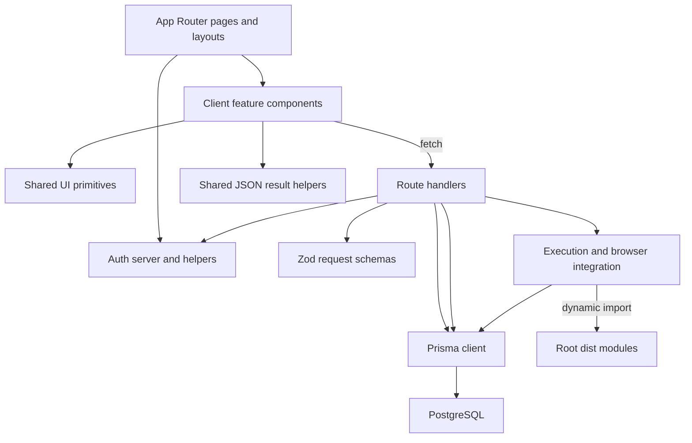

Most feature pages delegate to client components that fetch after render.
`dashboard/src/app/dashboard/layout.tsx` is the server authentication boundary.
There is no middleware. Prisma, Better Auth, filesystem access, and engine
loading stay server-side.

## 10. Authentication Architecture

**Diagram 5 — Registration, login, session, and protected access**

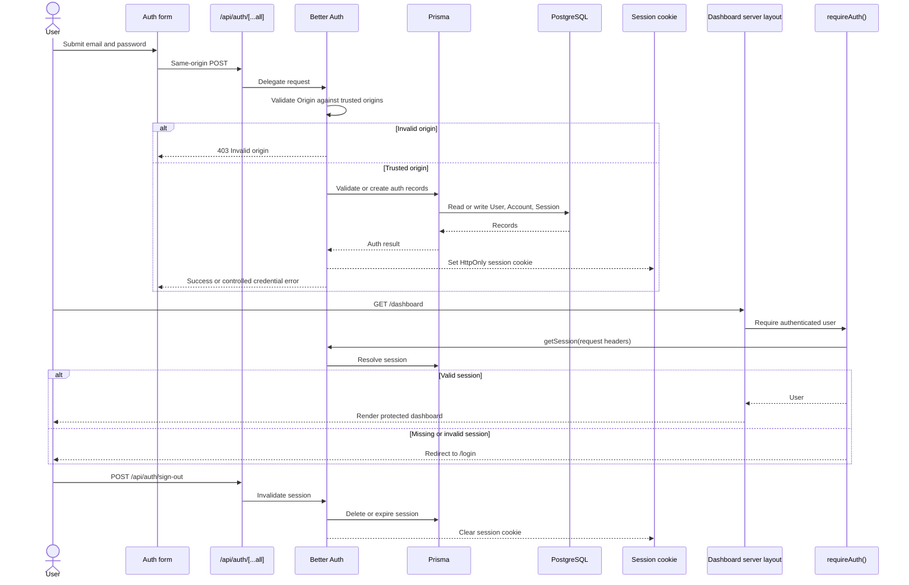

The cookie was previously observed as `HttpOnly`, `SameSite=Lax`, `Path=/`, and
seven-day max age; `Secure` was false for local HTTP, while production HTTPS can
enable secure-cookie behavior. Cookie values and secrets are not documented.

**Diagram 6 — Auth configuration flow**

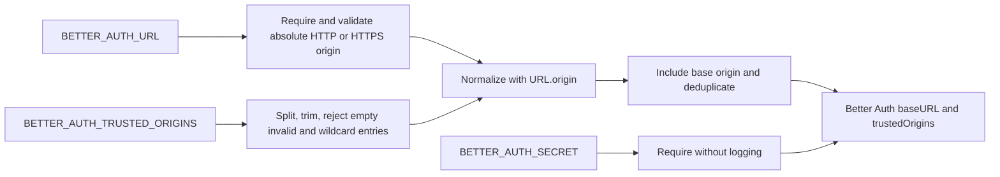

The implementation has no localhost fallback and does not trust request headers.
Development intentionally runs on port 3001. Environment values are evaluated
when the auth module is initialized in the Next.js process.

## 11. Database Architecture

**Diagram 7 — Current implemented data model**

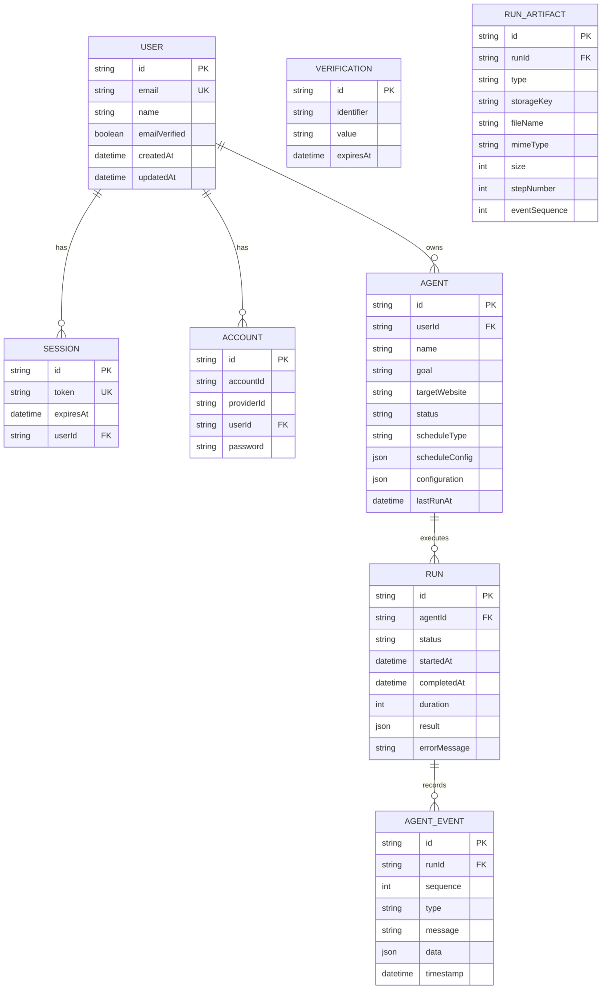

Ownership is rooted at `User -> Agent -> Run -> AgentEvent/RunArtifact`. Cascading deletes
apply along those relationships and to auth sessions/accounts. Important
indexes cover session/account user IDs, agent ownership/status, run agent/status
and start time, and event run/time/type. Agent configuration, schedule
configuration, and run result are JSON fields.

`AgentEvent` has a unique `(runId, sequence)` key and bounded JSON data.
`RunArtifact` stores relative opaque storage keys and safe metadata. Terminal
Run state, engine events, artifact metadata, and the terminal event are written
in one retry-safe transaction. Idempotency/job metadata remains absent.

**Diagram 8 — Proposed data additions, not implemented**

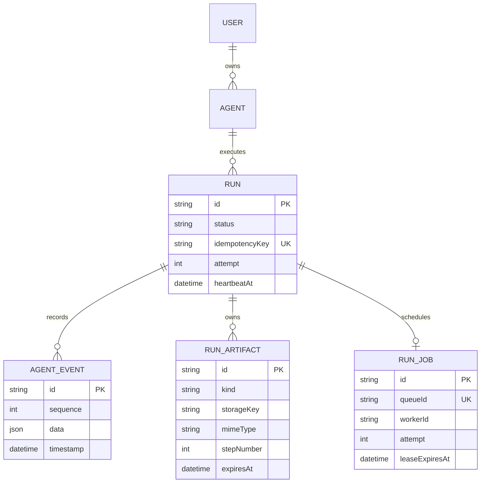

This future model would make ordering, artifacts, retries, leases, and
idempotency durable. It requires a deliberate schema migration and is not part
of the current repository.

## 12. Agent CRUD Architecture

**Diagram 9 — Current CRUD request sequence**

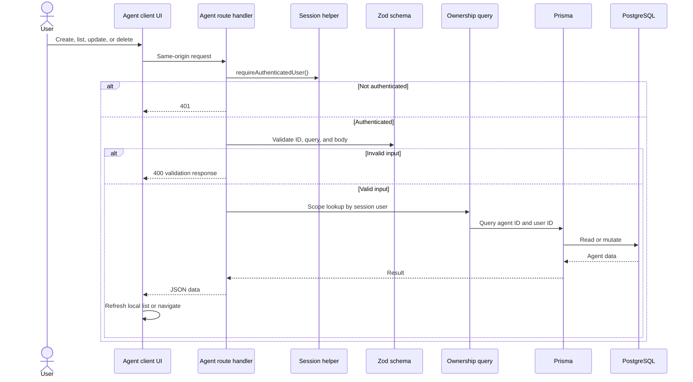

| Operation | Route              | Method | Validation                 | Ownership enforcement       | Database action         |
| --------- | ------------------ | ------ | -------------------------- | --------------------------- | ----------------------- |
| List      | `/api/agents`      | GET    | Session                    | `where.userId`              | `findMany`              |
| Create    | `/api/agents`      | POST   | Zod create schema          | `userId` comes from session | `create`                |
| Read      | `/api/agents/[id]` | GET    | Nonempty ID                | ID plus session user        | `findFirst`             |
| Update    | `/api/agents/[id]` | PATCH  | ID plus partial Zod schema | Preflight ownership helper  | `update`                |
| Delete    | `/api/agents/[id]` | DELETE | Nonempty ID                | Preflight ownership helper  | `delete`, with cascades |

List routes are unpaginated. `scheduleConfig` validation is permissive, and
schedule fields are stored but not executed by a scheduler.

## 13. Browser Execution Architecture

Phase 4 separates submission from execution. The authenticated route and
`PrismaAgentExecutionService` call `PrismaRunProducer`, which reserves an owned
`QUEUED` Run in PostgreSQL and submits a BullMQ job containing only
`{ version, runId }`. The API returns `202` and never imports or launches the
browser engine. A standalone Node worker validates the job, claims the Run with
a PostgreSQL lease, reconstructs task and configuration from trusted database
relations, and calls `BrowserExecutionService`.

PostgreSQL is authoritative for ownership, status, attempt, worker lease,
heartbeat, result, events, and artifacts. Redis is the durable delivery and
retry coordinator. The route and producer both scope the agent by the
authenticated session user. No user ID, task text, model configuration, secret,
or browser setting is accepted from or stored in the queue payload.

The diagram below records the former synchronous composition for historical
comparison. It is not the active request path.

**Diagram 10 — Execution service composition**

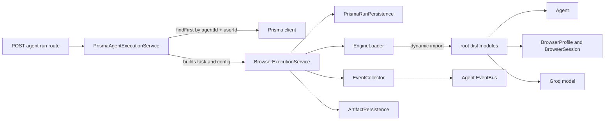

The route performs a preflight ownership lookup and the facade independently
repeats ownership enforcement in its database query. A nonexistent agent and an
agent owned by another user both produce the same `AGENT_NOT_FOUND` behavior.
This defense-in-depth boundary also applies if a future worker calls the facade
with a trusted user ID.

Public execution failures retain the existing string `error` field for client
compatibility and add a stable `code`:

| Code                          | HTTP | Public message                                                     |
| ----------------------------- | ---: | ------------------------------------------------------------------ |
| `AGENT_NOT_FOUND`             |  404 | Agent not found.                                                   |
| `INVALID_AGENT_CONFIGURATION` |  400 | This agent has an invalid execution configuration.                 |
| `EXECUTION_UNAVAILABLE`       |  503 | Agent execution is temporarily unavailable.                        |
| `EXECUTION_FAILED`            |  500 | The agent run failed. Review the run details for more information. |

Internal causes are logged server-side with a category, agent ID, run ID when
available, execution stage, and bounded redacted error metadata. The logger does
not receive task text, model output, page content, credentials, cookies, or
environment objects. Failed run rows and failure events receive only the fixed
safe public message.

## 14. Historical Synchronous Execution Pipeline

**Diagram 11 — Actual synchronous run sequence**

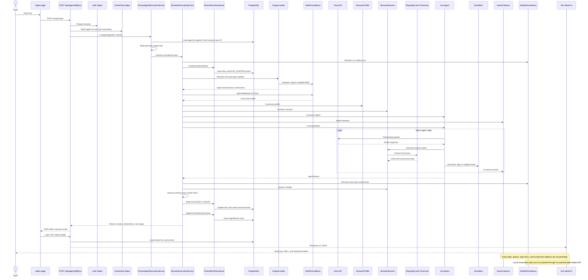

The API response can transiently contain screenshot base64, local paths, event
data, and raw output. The current UI only waits for completion and refreshes; it
does not retain that response. Only the `Run.result` summary/URLs and reduced
`AgentEvent` rows survive for later inspection.

**Diagram 12 — Execution decisions and failure coverage**

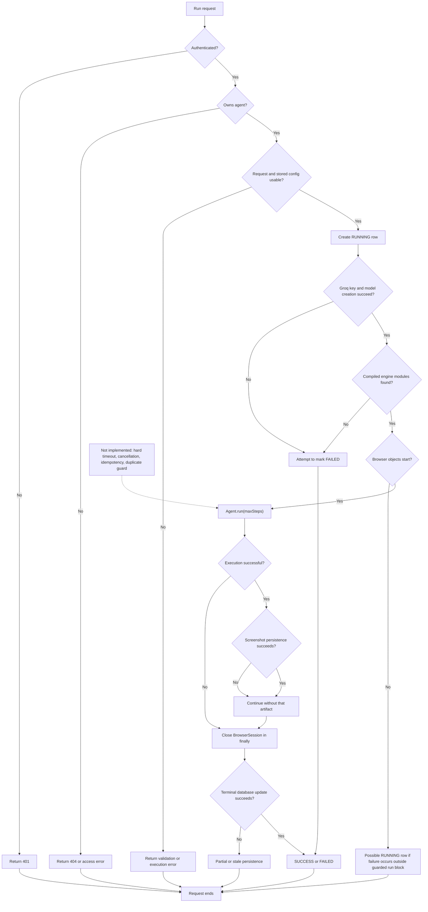

Browser cleanup is in `finally` around `Agent.run()`, but construction and some
persistence steps sit outside that protected region. Screenshot failures are
treated as best-effort. Terminal persistence is non-transactional.

### Current Phase 4 execution sequence

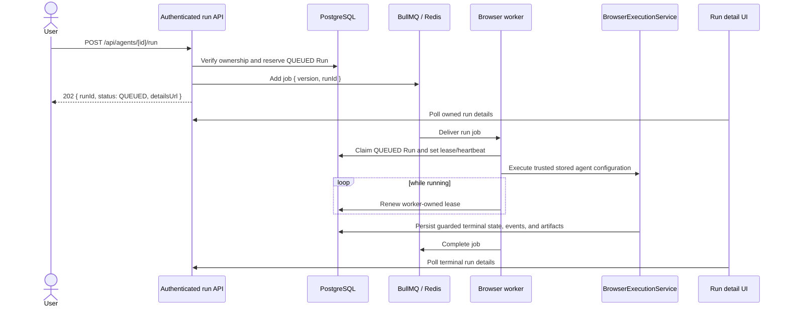

Queue retries are bounded and exponential. Only infrastructure-unavailable
failures are retryable; invalid configuration, timeout, unsuccessful agent
history, and deterministic execution failures become terminal. A retry releases
the worker lease and moves `RUNNING` back to `QUEUED`. Terminal redelivery is an
idempotent no-op. Queue overload returns a safe `429`; Redis/enqueue failures
return safe `503` responses and never expose Redis details.

## 15. Run State Model

Phase 4 implements:

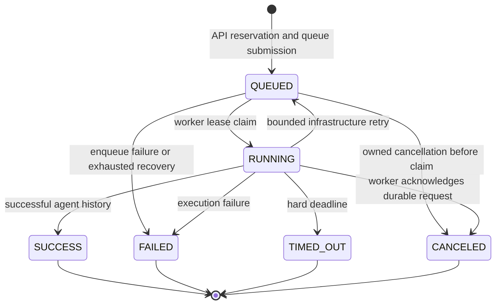

`workerId`, `heartbeatAt`, and `leaseExpiresAt` prove the active owner.
`attempt` and `lastFailureCode` support retry and recovery decisions.
`queueJobId` is unique and normally equals the Run ID. Cancellation metadata is
stored in `cancelRequestedAt`, `canceledAt`, `canceledByUserId`, and
`cancelReason`. `CANCELED` is terminal. All terminal persistence and retry
release use status/cancellation guards under a per-run advisory lock: whichever
terminal decision commits first remains authoritative.

## 16. Event Pipeline

**Diagram 15 — Engine event reduction**

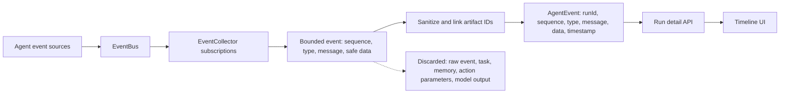

The collector subscribes to create-task, create-step, and update-task engine
events. Their dashboard types are mapped to `STEP_STARTED`, `STEP_COMPLETED`,
and `SYSTEM`. Separate run-started and terminal events are written directly.

| Engine event information | Collected in memory            | Persisted in DB                  | Displayed in UI | Lost                    |
| ------------------------ | ------------------------------ | -------------------------------- | --------------- | ----------------------- |
| Type                     | Yes, simplified plus raw class | Yes, mapped enum                 | Yes             | Original class name     |
| Message                  | Yes                            | Yes                              | Yes             | No                      |
| Timestamp                | Yes                            | Yes                              | Yes             | No                      |
| Sequence                 | Yes, starts after RUN_STARTED  | Yes, unique per run              | Yes             | No                      |
| URL                      | Validated HTTP/HTTPS only      | Yes                              | Yes             | Invalid/credential URLs |
| Step number              | Yes                            | Yes                              | Yes             | No                      |
| Action                   | Top-level action names only    | Bounded summary                  | Yes             | Inputs and outputs      |
| Tool input/output        | May exist in raw event         | No                               | No              | Yes                     |
| Screenshot relation      | Step event sequence            | Artifact IDs plus event sequence | Yes             | Raw data URL            |
| Raw data payload         | Never retained                 | No                               | No              | Yes                     |

Events are fetched by `sequence ASC`, with timestamp as a secondary order.
Legacy rows were backfilled by per-run timestamp and ID ordering.

## 17. Screenshot and Artifact Pipeline

**Diagram 16 — Current durable artifact flow**

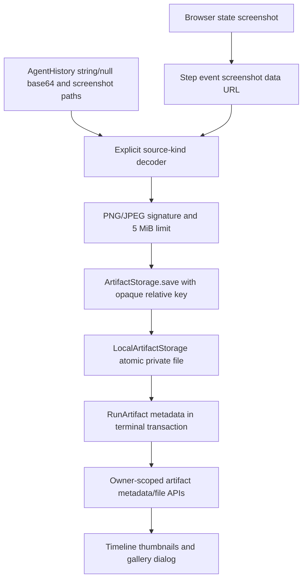

| Artifact step          | Status               | Implementation                               | Limitation                   |
| ---------------------- | -------------------- | -------------------------------------------- | ---------------------------- |
| Produced               | ✅ VERIFIED          | Root step event PNG data URL                 | Controlled execution         |
| Discovered             | ✅ VERIFIED          | Explicit data URL/base64/file source union   | Proven root shapes only      |
| Copied/saved           | ✅ VERIFIED          | Atomic local write and SHA-256 deduplication | Best-effort                  |
| Named                  | ✅ VERIFIED          | Server-generated filename and opaque key     | No user filenames            |
| Associated with run    | ✅ VERIFIED          | Run, step, and event sequence metadata       | No cross-run lookup          |
| Persisted in DB        | ✅ VERIFIED          | `RunArtifact` metadata only                  | No image bytes in PostgreSQL |
| Protected by ownership | ✅ VERIFIED          | Run ownership and artifact/run match         | Missing/cross-user 404       |
| Served through API     | ✅ VERIFIED          | Private image response with `nosniff`        | Local-node availability      |
| Displayed in UI        | ✅ VERIFIED          | Timeline thumbnails and navigable gallery    | No live updates              |
| Retained/cleaned up    | 🔴 MISSING OR BROKEN | None                                         | Unbounded local files        |

## 18. Observable Data Boundary

The browser engine can hold far more information than the database and UI keep.
During execution, engine events may contain step numbers, URLs, actions, memory,
next goals, and screenshots. The dashboard deliberately reduces this at the
trusted server boundary.

The persistence boundary retains:

- `Run.status`, timing, error text, and `result`
- bounded summary and validated visited URLs
- ordered `AgentEvent` type, message, timestamp, and safe structured data
- `RunArtifact` image metadata and relative opaque storage key

The immediate response contains identifiers, counts, summary, and URLs only.
The detail page reconstructs persisted actions and screenshots after refresh.
Memory, full action inputs/outputs, raw model history, DOM/HTML, cookies, and
credentials are intentionally unavailable; the feature is observability, not a
lossless replay system.

## 19. Run.result Data Architecture

**Diagram 17 — JSON result from persistence to UI**

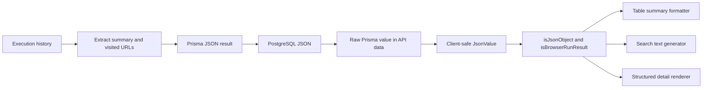

The expected success shape is:

```ts
{
  summary: string | null;
  visitedUrls: string[];
}
```

The database contract remains generic JSON because legacy or unexpected rows
may be null, strings, numbers, booleans, arrays, or other objects.
`dashboard/src/lib/types.ts` defines a recursive browser-safe `JsonValue`
without importing Prisma runtime code. The formatter module validates objects,
visited URL entries, and HTTP/HTTPS links; it safely formats and truncates all
valid JSON shapes. Search calls `.toLowerCase()` only on generated text.

Focused Vitest coverage exercises 14 result-shape and non-throwing cases.

## 20. Frontend Architecture

**Diagram 18 — App Router component and data flow**

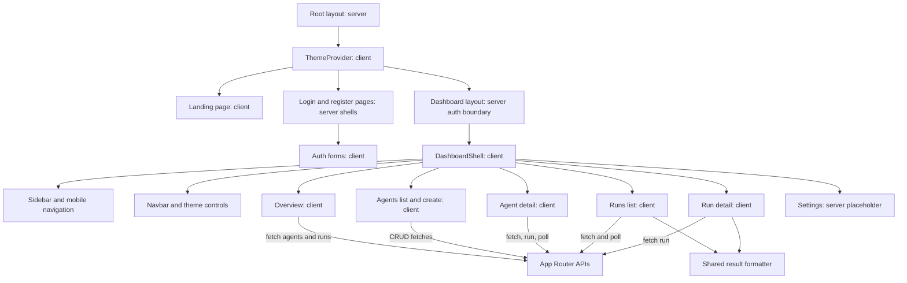

| Page/component       | Server or client           | Data source          | Auth requirement           | Main responsibility                              |
| -------------------- | -------------------------- | -------------------- | -------------------------- | ------------------------------------------------ |
| Root layout          | Server                     | Static metadata      | Public                     | HTML shell and theme provider                    |
| Landing page         | Client                     | Static content       | Public                     | Product introduction and navigation              |
| Login/register pages | Server plus client form    | Better Auth route    | Public                     | Credential submission and controlled errors      |
| Dashboard layout     | Server                     | Better Auth session  | Required                   | Redirect unauthenticated users; render shell     |
| Dashboard overview   | Client                     | Agents and runs APIs | Required by layout and API | Counts and recent run summaries                  |
| Agents page          | Client                     | `/api/agents`        | Required                   | List, run, and delete agents                     |
| Create agent page    | Client                     | `POST /api/agents`   | Required                   | Validate and submit agent settings               |
| Agent detail page    | Server wrapper plus client | Agent and run APIs   | Required                   | Agent metadata, runs, execution trigger, polling |
| Runs page            | Client                     | `/api/runs`          | Required                   | Search, status filter, polling, result table     |
| Run detail page      | Server wrapper plus client | `/api/runs/[id]`     | Required                   | Safe result rendering and coarse event timeline  |
| Settings page        | Server                     | None                 | Required                   | Placeholder settings view                        |

Feature clients show loading, error, and empty states. Polling runs while a
visible run is `QUEUED` or `RUNNING`; no push transport exists. The runs table
currently has no active navigation control to run details, even though the
detail route exists. The overview “view all runs” control is also not wired.

## 21. API Architecture

**Diagram 19 — Route groups and server dependencies**

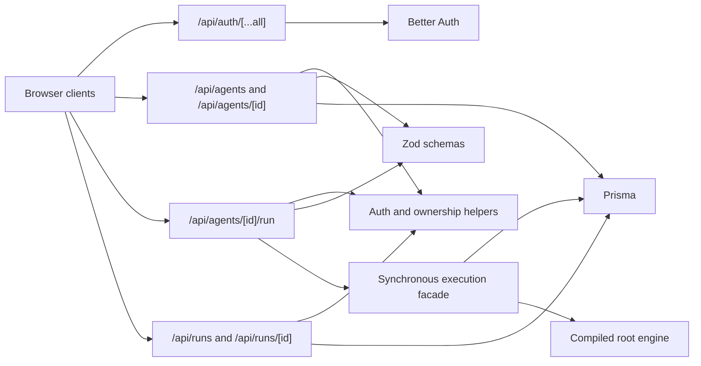

| Route                  | Method                    | Handler file                           | Auth        | Ownership                           | Validation               | Response                          |
| ---------------------- | ------------------------- | -------------------------------------- | ----------- | ----------------------------------- | ------------------------ | --------------------------------- |
| `/api/auth/[...all]`   | GET/POST/PATCH/PUT/DELETE | `src/app/api/auth/[...all]/route.ts`   | Better Auth | Auth records belong to session/user | Better Auth              | Better Auth response/cookies      |
| `/api/agents`          | GET                       | `src/app/api/agents/route.ts`          | Required    | `where.userId`                      | Session                  | `{ data: Agent[] }`               |
| `/api/agents`          | POST                      | same                                   | Required    | Session user inserted               | Zod create schema        | `201 { data: Agent }`             |
| `/api/agents/[id]`     | GET                       | `src/app/api/agents/[id]/route.ts`     | Required    | ID plus user ID                     | Agent ID                 | `{ data: Agent }`                 |
| `/api/agents/[id]`     | PATCH                     | same                                   | Required    | Preflight ownership                 | Partial Zod schema       | `{ data: Agent }`                 |
| `/api/agents/[id]`     | DELETE                    | same                                   | Required    | Preflight ownership                 | Agent ID                 | `{ deleted: true, id }`           |
| `/api/agents/[id]/run` | POST                      | `src/app/api/agents/[id]/run/route.ts` | Required    | Route preflight                     | ID and strict empty body | `{ data: executionResult }`       |
| `/api/runs`            | GET                       | `src/app/api/runs/route.ts`            | Required    | Nested `agent.userId` scope         | Optional agent ID query  | `{ data: Run[] }`                 |
| `/api/runs/[id]`       | GET                       | `src/app/api/runs/[id]/route.ts`       | Required    | Run through owned agent             | Run ID                   | `{ data: RunWithAgentAndEvents }` |

The execution POST is long-running and returns only after browser work ends.
Agent and run lists are unpaginated. No route has rate limiting or idempotency.
Execution exceptions currently return raw `Error.message` text, which can expose
internal detail. Run APIs return Prisma JSON values without changing the
envelope; shared client types safely represent that contract.

## 22. Server and Client Boundaries

**Diagram 20 — Runtime trust and bundling boundaries**

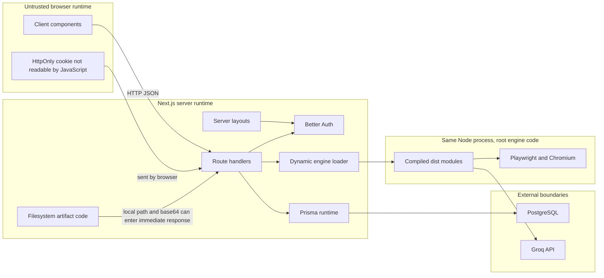

Observed boundary properties and risks:

- Shared client types do not import Prisma runtime; `JsonValue` is locally
  recursive and browser-safe.
- Database, auth secret, Groq key, engine loading, and filesystem code remain
  server-only. No secret is configured through a `NEXT_PUBLIC_` variable.
- Dynamic imports prevent root engine modules from being statically bundled
  through normal dashboard imports, but make runtime `dist/` availability a
  deployment requirement.
- The immediate run response may contain large base64 screenshots, raw model
  output, and local filesystem paths. It is owner-scoped at the route but is
  still an undesirable data/size boundary.
- Artifact files have no authenticated serving boundary. They are not currently
  exposed by a route, but this also makes them unusable by the product.

## 23. Module Dependency Map

**Diagram 21 — Important internal dependencies**

```mermaid
flowchart TB
    AuthRoute["Auth catch-all"] --> AuthServer["lib/auth/index.ts"]
    DashboardLayout["Dashboard layout"] --> AuthHelpers["lib/auth/helpers.ts"]
    AgentAPI["Agent API routes"] --> RouteHelpers["lib/api/route-helpers.ts"]
    RunAPI["Run API routes"] --> RouteHelpers
    RouteHelpers --> AuthHelpers
    RouteHelpers --> Prisma["lib/db/prisma.ts"]
    AgentAPI --> Schemas["lib/api/schemas.ts"]
    ExecuteAPI["Run execution route"] --> Facade["lib/execution/prisma-agent-execution-service.ts"]
    Facade --> Prisma
    Facade --> Orchestrator["lib/browser/engine.ts"]
    Orchestrator --> Loader["engine-loader.ts"]
    Orchestrator --> Collector["event-collector.ts"]
    Orchestrator --> Artifact["artifact-persistence.ts"]
    Orchestrator --> Store["run-persistence.ts"]
    Store --> Prisma
    Loader -->|"dynamically imports"| Dist["root dist modules"]
    RunPages["Run client components"] --> Types["lib/types.ts"]
    RunPages --> Formatter["utils/format-run-result.ts"]
    Formatter --> Types
    RunAPI --> Types
```

The 2026-07-24 repository cleanup removed the previously identified ownership
helper aliases, `verifyUserAccess`, execution barrel, unused `BaseChatModel`
dashboard load, inactive run-table imports, and unused dashboard dependencies.
No non-convention dashboard source file now has zero inbound module references.
Root provider modules, package exports, CLI entries, tests, generated engine
output, and direct App Router files were deliberately retained.

## 24. Complete File Connection Map

The table gives a compact cross-layer index; the detailed entries below explain
runtime relationships.

| Path                                               | Layer                   | Responsibility                                  | Imported by / Used by                    | Runtime                   |
| -------------------------------------------------- | ----------------------- | ----------------------------------------------- | ---------------------------------------- | ------------------------- |
| `package.json`                                     | Root configuration      | Engine scripts, exports, binaries, dependencies | pnpm, Node consumers                     | Build/development         |
| `tsconfig.json`                                    | Root configuration      | Strict engine compilation to `dist`             | TypeScript                               | Build time                |
| `vitest.config.ts`                                 | Root tests              | Test discovery and environment                  | Vitest                                   | Test runtime              |
| `src/index.ts`                                     | Root engine             | Public export barrel                            | CLI and library consumers                | Build time / engine       |
| `src/agent/service.ts`                             | Root engine             | Agent orchestration loop                        | Root exports; compiled dashboard runtime | Browser execution process |
| `src/browser/session.ts`                           | Root engine             | Playwright session lifecycle                    | Agent and dashboard-created instances    | Browser execution process |
| `src/browser/profile.ts`                           | Root engine             | Browser launch/context policy                   | Browser session and dashboard            | Browser execution process |
| `src/event-bus.ts`                                 | Root engine             | Typed event dispatch                            | Agent and event consumers                | Browser execution process |
| `src/llm/models.ts`                                | Root engine             | Provider factory                                | Dashboard engine loader                  | Browser execution process |
| `dist/agent/index.js`                              | Generated engine        | Runtime Agent exports                           | Dashboard `EngineLoader`                 | Generated engine output   |
| `dashboard/package.json`                           | Dashboard configuration | Next.js scripts and dependencies                | pnpm and Next.js                         | Build/development         |
| `dashboard/.env.example`                           | Dashboard configuration | Safe auth/database template                     | Developers                               | Setup only                |
| `dashboard/src/lib/auth/index.ts`                  | Auth                    | Better Auth configuration                       | Auth route/helpers                       | Next.js server            |
| `dashboard/src/lib/auth/helpers.ts`                | Auth                    | Session and redirect helpers                    | Layout and API helpers                   | Next.js server            |
| `dashboard/src/lib/db/prisma.ts`                   | Database                | Prisma singleton                                | Auth, APIs, persistence                  | Next.js server            |
| `dashboard/src/lib/api/route-helpers.ts`           | API                     | Auth and ownership checks                       | Agent/run routes                         | API request               |
| `dashboard/src/lib/browser/*`                      | Execution               | Engine orchestration and persistence            | Execution facade                         | Browser execution process |
| `dashboard/src/lib/types.ts`                       | Shared                  | JSON-safe run/API contracts                     | Run UI, formatter, APIs                  | Shared type-only          |
| `dashboard/src/lib/utils/format-run-result.ts`     | Shared                  | Safe result guards/formatting                   | Run and overview UI                      | Browser client / tests    |
| `dashboard/src/app/api/**`                         | API                     | Auth, CRUD, run APIs                            | Browser fetches                          | API request               |
| `dashboard/src/app/dashboard/layout.tsx`           | Frontend                | Server auth boundary                            | Dashboard routes                         | Next.js server            |
| `dashboard/src/components/layout/*`                | Frontend                | Protected shell and navigation                  | Dashboard layout                         | Browser client            |
| `dashboard/src/components/dashboard/*`             | Frontend                | Overview, agent, and run features               | Dashboard pages                          | Browser client            |
| `dashboard/src/components/dashboard/run-*.tsx`     | Frontend                | Run list/detail rendering                       | Run pages                                | Browser client            |
| `dashboard/prisma/schema.prisma`                   | Database                | Persistent model contract                       | Prisma generate/validate                 | Build/database            |
| `dashboard/prisma/migrations/20260722191638_init/` | Database                | Initial schema migration                        | Prisma migration tooling                 | Database setup            |
| `test/dashboard-run-result.test.ts`                | Tests                   | Result utility regression tests                 | Vitest                                   | Test runtime              |

### Root Engine

### `package.json`

- Purpose: Defines the root ESM package, exports, CLI binaries, scripts,
  dependencies, and supported Node version.
- Imports: Not applicable.
- Imported by: pnpm, Node resolution, `EngineLoader` root discovery, and package
  consumers.
- Calls: TypeScript, `tsx`, ESLint, Vitest, and the build asset-copy script.
- Reads: Root lockfile and source configuration.
- Writes: `dist/` through the build script.
- Runtime: Build, development, package resolution, and CLI startup.
- Status: ✅ Active.
- Important risks: Root postinstall downloads Chromium; deployments should
  package binaries rather than install them at request time.

### `tsconfig.json`, `eslint.config.js`, and `vitest.config.ts`

- Purpose: Define strict compilation, lint/format policy, and test runtime.
- Imports: TypeScript, ESLint, Prettier, and Vitest configuration APIs.
- Imported by: Root quality commands.
- Calls: Compiler, linter, and test discovery behavior.
- Reads: `src/`, `test/`, and related configuration.
- Writes: Compiler output only for build.
- Runtime: Build and test time.
- Status: 🟠 Typecheck passes; lint currently fails on line-ending formatting.
- Important risks: A failing formatting gate obscures higher-value lint output.

### `src/index.ts`

- Purpose: Public engine barrel for configuration, browser, DOM, agent, tools,
  LLMs, telemetry, screenshots, skills, sandbox, and related systems.
- Imports: Root feature modules for re-export.
- Imported by: Library consumers and CLI-oriented code; compiled to `dist`.
- Calls: None directly.
- Reads: Module definitions.
- Writes: Nothing at runtime.
- Runtime: Build time and root library import.
- Status: ✅ Active.
- Important risks: A broad public surface increases compatibility obligations.

### `src/agent/service.ts`

- Purpose: Implements `Agent`, lifecycle setup, step loop, history, events, and
  closure.
- Imports: LLM, browser, controller/tools, prompts/messages, event types,
  telemetry, token accounting, and views.
- Imported by: Agent exports and compiled dashboard execution.
- Calls: `BrowserSession.start()`, LLM invocations, tool execution,
  `EventBus.dispatch()`, and close paths.
- Reads: Task, run settings, browser state, model responses.
- Writes: In-memory history/events and optional engine artifacts.
- Runtime: Browser execution process.
- Status: ✅ Active; not executed during this documentation task.
- Important risks: Long-running stateful work is currently hosted by an API
  request in the dashboard.

### `src/browser/session.ts`

- Purpose: Owns browser startup, tabs, DOM interaction, screenshots, watchdogs,
  and shutdown.
- Imports: Playwright, profile, DOM, browser events, watchdogs, and utilities.
- Imported by: Agent and dashboard-created execution objects.
- Calls: Playwright browser/context/page APIs.
- Reads: Browser profile and environment.
- Writes: Browser state and engine-local data.
- Runtime: Browser execution process.
- Status: ✅ Active.
- Important risks: Chromium availability, process resources, and cleanup are
  deployment-critical.

### `src/browser/profile.ts`

- Purpose: Normalizes browser launch/context configuration.
- Imports: Browser configuration and utility types.
- Imported by: Browser session and dashboard orchestrator through `dist`.
- Calls: Configuration validation and normalization.
- Reads: Headless and viewport options.
- Writes: No external state.
- Runtime: Browser execution process.
- Status: ✅ Active.
- Important risks: Dashboard exposes only a subset of root policy controls.

### `src/event-bus.ts`

- Purpose: Subscribe, dispatch, time out, and retain engine event results.
- Imports: Event/view utilities.
- Imported by: Agent and engine subsystems.
- Calls: Registered handlers.
- Reads: In-memory subscriptions.
- Writes: In-memory event history.
- Runtime: Browser execution process.
- Status: ✅ Active.
- Important risks: Dashboard persistence intentionally discards most payload
  detail.

### `src/llm/models.ts`

- Purpose: Creates root chat model adapters by provider name.
- Imports: Provider-specific adapters including Groq.
- Imported by: Root consumers and dashboard `EngineLoader` through `dist`.
- Calls: Provider constructors; Groq constructor reads its API key.
- Reads: Provider keys and model options.
- Writes: No persistent state.
- Runtime: Browser execution process.
- Status: ✅ Active.
- Important risks: Provider availability and output remain external runtime
  dependencies; dashboard error boundaries redact provider internals.

### `src/cli-entry.ts`

- Purpose: Lazy CLI bootstrap for the package binaries.
- Imports: CLI implementation on demand.
- Imported by: Package `bin` entries after compilation.
- Calls: CLI main routine.
- Reads: Arguments and environment.
- Writes: CLI-selected outputs.
- Runtime: Root command line.
- Status: ✅ Active but separate from dashboard.
- Important risks: None specific to dashboard.

### `dist/`

- Purpose: Generated JavaScript and declarations consumed by the dashboard.
- Imports: Compiled internal root dependencies.
- Imported by: `dashboard/src/lib/browser/engine-loader.ts`.
- Calls: Root engine behavior.
- Reads: Runtime configuration and provider credentials.
- Writes: Engine/browser outputs.
- Runtime: Generated engine output in the Next.js Node process.
- Status: ✅ Present and ignored by Git.
- Important risks: Can be stale or absent because dashboard start does not build
  it.

### Dashboard Configuration

### `dashboard/package.json`

- Purpose: Dashboard scripts and dependency declaration.
- Imports: Not applicable.
- Imported by: pnpm and Next.js tooling.
- Calls: `next dev -p 3001`, build, lint, and Prisma commands.
- Reads: Package metadata and lockfile.
- Writes: Tool-generated `.next` or Prisma client output when invoked.
- Runtime: Build and development setup.
- Status: ✅ Active.
- Important risks: Declared ranges and lock-resolved versions differ; deployment
  must use the lockfile.

### `dashboard/.env.example`

- Purpose: Documents database and auth/trusted-origin variable names using
  placeholders and the intended local origin.
- Imports: Not applicable.
- Imported by: Developers during local setup.
- Calls: None.
- Reads/Writes: No runtime state; real values belong in ignored local or server
  environment configuration.
- Runtime: Setup only.
- Status: ✅ Safe template; no reusable secret is documented.
- Important risks: Unreplaced placeholders intentionally cause startup errors.
  The template does not currently document the `GROQ_API_KEY` required for
  dashboard execution.

### `dashboard/next.config.ts`

- Purpose: Next.js runtime/build configuration and output tracing root.
- Imports: Next configuration types.
- Imported by: Next.js.
- Calls: None.
- Reads: Repository location.
- Writes: Nothing directly.
- Runtime: Build and server startup.
- Status: ✅ Active.
- Important risks: Root runtime files must be included deliberately in deploys.

### `dashboard/tsconfig.json`

- Purpose: Strict TypeScript settings, aliases, and Next plugin setup.
- Imports: Not applicable.
- Imported by: TypeScript and Next.js.
- Calls: None.
- Reads: Dashboard source and generated Next types.
- Writes: Incremental metadata only when enabled.
- Runtime: Build time.
- Status: ✅ Active.
- Important risks: Only the active `@/*` dashboard alias remains. Root engine
  modules are loaded from compiled output dynamically instead of through
  build-time source aliases.

### Authentication

### `dashboard/src/lib/auth/index.ts`

- Purpose: Validates auth URL, trusted origins, and secret; constructs Better
  Auth with Prisma and cookie integration.
- Imports: Better Auth, Prisma adapter, Next cookie integration, Prisma client.
- Imported by: Auth route and session helpers.
- Calls: URL validation and `betterAuth()`.
- Reads: Required auth environment variables.
- Writes: Auth records through Better Auth.
- Runtime: Next.js server module initialization and auth requests.
- Status: ✅ Active and previously runtime verified.
- Important risks: Configuration changes require process restart.

### `dashboard/src/lib/auth/helpers.ts`

- Purpose: Gets the current session user and redirects unauthenticated page
  requests.
- Imports: Request headers, Next redirect, auth instance.
- Imported by: Dashboard layout and route helper layer.
- Calls: `auth.api.getSession()`.
- Reads: Request cookie headers.
- Writes: Nothing.
- Runtime: Next.js server.
- Status: ✅ Active; unused access helpers were removed on 2026-07-24.
- Important risks: APIs must use their own guard because there is no middleware.

### `dashboard/src/app/api/auth/[...all]/route.ts`

- Purpose: Exposes Better Auth’s catch-all HTTP handlers.
- Imports: Auth server and Better Auth Next handler adapter.
- Imported by: Next.js route discovery.
- Calls: Better Auth handlers.
- Reads: Request origin, credentials, and cookies.
- Writes: Auth database records and response cookies.
- Runtime: API request.
- Status: ✅ Active and previously runtime verified.
- Important risks: None observed in local strict-origin configuration.

### API And Database

### `dashboard/src/lib/db/prisma.ts`

- Purpose: Reuses a Prisma client across development module reloads.
- Imports: Generated Prisma client.
- Imported by: Auth, route helpers, routes, and run persistence.
- Calls: Prisma query APIs.
- Reads/Writes: PostgreSQL.
- Runtime: Next.js server only.
- Status: ✅ Active.
- Important risks: Development query logging may expose operational data to
  local logs.

### `dashboard/src/lib/api/route-helpers.ts`

- Purpose: Central session checks and agent/run ownership lookups.
- Imports: Auth helpers and Prisma.
- Imported by: Agent and run route handlers.
- Calls: Session lookup and scoped Prisma queries.
- Reads: User, agent, run, and event records.
- Writes: Nothing.
- Runtime: API request.
- Status: ✅ Active.
- Important risks: Event ordering is not explicit.

### `dashboard/src/lib/api/schemas.ts`

- Purpose: Validates agent IDs, create/update bodies, target URLs, Groq models,
  browser settings, and execution body.
- Imports: Zod.
- Imported by: Agent CRUD and execution routes.
- Calls: Zod parsers.
- Reads: Request data.
- Writes: Nothing.
- Runtime: API request and client-compatible validation logic.
- Status: ✅ Active.
- Important risks: `scheduleConfig` is broad; existing stored config
  normalization is not as bounded as create-time validation.

### `dashboard/src/app/api/agents/route.ts`

- Purpose: List and create agents.
- Imports: Prisma, auth helper, and create schema.
- Imported by: Next.js route discovery; called by agent UIs.
- Calls: Auth and scoped Prisma list/create.
- Reads/Writes: Agent rows.
- Runtime: API request.
- Status: 🟡 Connected, not runtime-tested here.
- Important risks: Unpaginated list.

### `dashboard/src/app/api/agents/[id]/route.ts`

- Purpose: Read, update, and delete one owned agent.
- Imports: Auth/ownership helpers, validation, Prisma.
- Imported by: Next.js; called by agent detail/list clients.
- Calls: Ownership lookup and Prisma mutations.
- Reads/Writes: Agent and cascade-related rows.
- Runtime: API request.
- Status: 🟡 Connected, not runtime-tested here.
- Important risks: Delete cascades run history; UI needs clear confirmation.

### `dashboard/src/app/api/agents/[id]/run/route.ts`

- Purpose: Authenticate, authorize, and synchronously execute an agent.
- Imports: Route helpers, validation, and execution facade.
- Imported by: Next.js; called by agent UI.
- Calls: Full browser execution.
- Reads/Writes: Agent, run, event, artifact, and external runtime state.
- Runtime: Long-running API request.
- Status: 🟠 Partial.
- Important risks: No rate limit/idempotency and unbounded request duration.

### `dashboard/src/app/api/runs/route.ts`

- Purpose: List owned runs, optionally for one agent.
- Imports: Auth helper, Prisma, shared response types.
- Imported by: Next.js; called by overview, agent detail, and runs page.
- Calls: Nested ownership-scoped `findMany`.
- Reads: Run rows and agent summaries.
- Writes: Nothing.
- Runtime: API request.
- Status: ✅ Type-safe and connected.
- Important risks: Unpaginated polling queries.

### `dashboard/src/app/api/runs/[id]/route.ts`

- Purpose: Return one owned run with agent and events.
- Imports: Run ownership helper and shared response type.
- Imported by: Next.js; called by run detail client.
- Calls: Scoped Prisma read.
- Reads: Run, agent, and event rows.
- Writes: Nothing.
- Runtime: API request.
- Status: ✅ Type-safe and connected.
- Important risks: Event relation has no explicit order/pagination.

### `dashboard/prisma/schema.prisma`

- Purpose: Defines auth, agent, run, and event persistence.
- Imports: Prisma generator and PostgreSQL datasource configuration.
- Imported by: Prisma generation, validation, and migrations.
- Calls: Not applicable.
- Reads: Database URL at tooling/runtime boundary.
- Writes: Generated client or migrations only when explicit commands run.
- Runtime: Build/tooling and Prisma database contract.
- Status: ✅ Validated; unchanged in this task.
- Important risks: Missing durable artifact/event/job fields.

### `dashboard/prisma/migrations/20260722191638_init/`

- Purpose: Contains the initial SQL migration for the current auth, agent, run,
  and event schema.
- Imports: Generated from the Prisma schema.
- Imported by: Prisma migration tooling.
- Calls: PostgreSQL DDL only when explicitly invoked.
- Reads: Migration SQL and lock metadata.
- Writes: Database schema state when applied.
- Runtime: Database setup/deployment.
- Status: ✅ Present; not run or modified in this task.
- Important risks: Future artifacts and jobs require a new reviewed migration,
  not ad hoc database changes.

### Execution

### `dashboard/src/lib/execution/prisma-agent-execution-service.ts`

- Purpose: Loads an agent, normalizes Groq/browser configuration, builds the
  task, and invokes browser execution.
- Imports: Prisma and browser execution service.
- Imported by: Run execution route.
- Calls: Agent query and `BrowserExecutionService.execute()`.
- Reads: Agent configuration.
- Writes: Indirectly through the orchestrator.
- Runtime: API request.
- Status: ✅ Ownership and error boundary verified; execution reliability remains
  partial.
- Important risks: Timeout is configuration data only.

### `dashboard/src/lib/execution/errors.ts`

- Purpose: Defines stable execution error codes/messages, status mappings,
  bounded error serialization, secret/path redaction, and persisted-message
  sanitization.
- Imports: No browser or Prisma runtime.
- Imported by: Execution route, facade, orchestrator, persistence, and run APIs.
- Calls: Pure normalization and redaction helpers.
- Reads: Selected server-side secret environment values only to redact matching
  text; values are never returned or logged.
- Writes: Nothing.
- Runtime: Server only.
- Status: ✅ Focused tests pass.
- Important risks: The schema has no dedicated execution error-code column.

### `dashboard/src/lib/browser/engine.ts`

- Purpose: Coordinates run creation, engine loading, LLM/browser/agent objects,
  events, screenshots, completion, and response.
- Imports: Loader, collector, artifact and run persistence, logger, root-facing
  types.
- Imported by: Prisma execution facade.
- Calls: `Agent.run()`, session close, persistence, and artifact methods.
- Reads: Execution input and agent history.
- Writes: Runs, events, local files, and logs.
- Runtime: Browser execution process within API request.
- Status: 🟠 Partial.
- Important risks: Narrow `try/finally`, partial persistence, large transient
  response, no deadline or cancellation.

### `dashboard/src/lib/browser/engine-loader.ts`

- Purpose: Walks parent directories to find root `package.json` and required
  `dist` modules, then dynamically imports them.
- Imports: Node filesystem/path/URL utilities.
- Imported by: Browser execution service.
- Calls: Runtime ESM imports through an indirect import function.
- Reads: Root package metadata and compiled files.
- Writes: Nothing.
- Runtime: Next.js Node process.
- Status: ✅ Connected; runtime load not exercised here.
- Important risks: Per-service cache lifetime and runtime filesystem layout.

### `dashboard/src/lib/browser/event-collector.ts`

- Purpose: Subscribes to selected engine events and builds in-memory normalized
  event records.
- Imports: Root-facing execution types.
- Imported by: Browser execution service.
- Calls: Agent EventBus subscription APIs.
- Reads: Task, step, and update events.
- Writes: In-memory event array.
- Runtime: Browser execution process.
- Status: 🟠 Partial.
- Important risks: Data is collected more richly than it is persisted.

### `dashboard/src/lib/browser/artifact-persistence.ts`

- Purpose: Creates run directories and saves screenshots from data URLs, base64,
  or file paths.
- Imports: Node filesystem/path and logger.
- Imported by: Browser execution service.
- Calls: Directory creation and file writes.
- Reads: Screenshot payloads and local paths.
- Writes: `browseruse_agent_data/screenshots/<runId>`.
- Runtime: Server filesystem.
- Status: 🟠 Partial.
- Important risks: No DB metadata, ownership route, retention, durable storage,
  or consistent history screenshot shape.

### `dashboard/src/lib/browser/run-persistence.ts`

- Purpose: Creates runs, marks terminal state, and appends reduced events.
- Imports: Prisma and browser execution types.
- Imported by: Browser execution service.
- Calls: Prisma run/event create/update operations.
- Reads/Writes: Run and AgentEvent rows.
- Runtime: API request/database.
- Status: 🟠 Partial.
- Important risks: Operations are not transactional; `lastRunAt` is not updated.

### Result Handling

### `dashboard/src/lib/types.ts`

- Purpose: Defines recursive client-safe JSON, browser result shape, run
  records, and API response contracts.
- Imports: Type-only or no runtime dependencies.
- Imported by: Result utilities, routes, and run-facing components.
- Calls: None.
- Reads/Writes: None.
- Runtime: Shared type-only.
- Status: ✅ Active.
- Important risks: API contracts remain compile-time only; no response decoder.

### `dashboard/src/lib/utils/format-run-result.ts`

- Purpose: Guard, extract, format, truncate, search, and validate links for any
  valid JSON result.
- Imports: Shared JSON types.
- Imported by: Run table/detail, overview, and focused tests.
- Calls: JSON serialization defensively and URL validation.
- Reads: `Run.result`.
- Writes: Nothing.
- Runtime: Browser client and tests.
- Status: ✅ Verified by focused tests.
- Important risks: Deep valid JSON is formatted, not schema-validated at the API
  boundary.

### Frontend Layouts And Pages

### `dashboard/src/app/layout.tsx`

- Purpose: Root HTML, metadata, global styles, and theme provider.
- Imports: Global CSS and theme provider.
- Imported by: Next.js App Router.
- Calls: React rendering only.
- Reads: Static metadata.
- Writes: HTML response.
- Runtime: Next.js server with client provider hydration.
- Status: ✅ Active.
- Important risks: None architectural.

### `dashboard/src/app/dashboard/layout.tsx`

- Purpose: Server-enforced authentication boundary around dashboard content.
- Imports: `requireAuth` dynamically and dashboard shell.
- Imported by: Nested dashboard routes.
- Calls: Session resolution and redirect.
- Reads: Request cookies/session.
- Writes: Server-rendered response.
- Runtime: Next.js server.
- Status: ✅ Verified.
- Important risks: Child APIs remain separately responsible for authorization.

### `dashboard/src/components/layout/dashboard-shell.tsx`

- Purpose: Client shell for sidebar, mobile navigation, navbar, and content.
- Imports: Dashboard navigation components.
- Imported by: Dashboard layout.
- Calls: UI state handlers.
- Reads: Authenticated user props.
- Writes: Client-rendered navigation state.
- Runtime: Browser client.
- Status: ✅ Active.
- Important risks: None significant.

### `dashboard/src/app/dashboard/page.tsx`

- Purpose: Mounts the dashboard overview experience.
- Imports: Overview component.
- Imported by: Next.js route discovery.
- Calls: Component rendering.
- Reads/Writes: Delegated to client.
- Runtime: App Router page.
- Status: ✅ Active.
- Important risks: Overview fetches after render and its runs navigation control
  is inert.

### `dashboard/src/app/dashboard/agents/page.tsx`

- Purpose: Hosts the agents list client.
- Imports: Agent table/list feature.
- Imported by: Next.js.
- Calls: Client fetch flows.
- Reads/Writes: Agents through APIs.
- Runtime: Browser client through page.
- Status: 🟡 Connected.
- Important risks: No pagination.

### `dashboard/src/app/dashboard/agents/create/page.tsx`

- Purpose: Agent creation form.
- Imports: Form/UI primitives and client navigation.
- Imported by: Next.js.
- Calls: `POST /api/agents`.
- Reads: User form fields.
- Writes: Agent through API.
- Runtime: Browser client.
- Status: 🟡 Connected.
- Important risks: Schedule metadata does not imply scheduler behavior.

### `dashboard/src/app/dashboard/agents/[id]/page.tsx`

- Purpose: Server route wrapper for an individual agent.
- Imports: Agent detail client.
- Imported by: Next.js.
- Calls: Component rendering.
- Reads/Writes: Delegated to client APIs.
- Runtime: Next.js page plus browser client.
- Status: 🟡 Connected.
- Important risks: Polling is the only run-progress mechanism.

### `dashboard/src/app/dashboard/runs/page.tsx`

- Purpose: Fetches, searches, filters, polls, and renders run history.
- Imports: Shared run types, result search helper, run table.
- Imported by: Next.js.
- Calls: `GET /api/runs`.
- Reads: Raw JSON results through safe helper.
- Writes: Client filter and list state.
- Runtime: Browser client.
- Status: ✅ Crash path repaired and typechecked.
- Important risks: Unpaginated two-second polling can become expensive.

### `dashboard/src/app/dashboard/runs/[id]/page.tsx`

- Purpose: Route wrapper for run detail.
- Imports: Run detail client.
- Imported by: Next.js.
- Calls: Component rendering.
- Reads/Writes: Delegated to API.
- Runtime: App Router page and browser client.
- Status: ✅ Connected.
- Important risks: Discoverability from the runs table is incomplete.

### `dashboard/src/components/dashboard/run-table.tsx`

- Purpose: Renders run status, timing, agent, and safe result summaries.
- Imports: Shared run records, formatter, badges, table components.
- Imported by: Runs page and other run-list surfaces.
- Calls: Result summary formatter.
- Reads: Run API data.
- Writes: Table UI.
- Runtime: Browser client.
- Status: ✅ Type-safe.
- Important risks: Detail-link imports exist but no active navigation is
  rendered.

### `dashboard/src/components/dashboard/run-detail-client.tsx`

- Purpose: Fetches one run and safely renders summary, valid URL links, unknown
  JSON, errors, metadata, and event timeline.
- Imports: Shared types, result guards/formatters, UI components.
- Imported by: Run detail page.
- Calls: `GET /api/runs/[id]`.
- Reads: Run, agent, result, and events.
- Writes: Loading/error/detail UI state.
- Runtime: Browser client.
- Status: ✅ Result rendering verified statically and by utility tests.
- Important risks: No screenshots or structured step payloads are available.

### Shared Components

### `dashboard/src/components/theme-provider.tsx`

- Purpose: Connects `next-themes` to the root layout.
- Imports: `ThemeProvider` from `next-themes`.
- Imported by: Root layout.
- Calls: Client theme context.
- Reads/Writes: Browser theme preference and DOM class.
- Runtime: Browser client.
- Status: ✅ Active.
- Important risks: None significant.

### `dashboard/src/components/ui/`

- Purpose: Reusable shadcn-compatible buttons, cards, badges, tables, forms,
  dialogs, and related primitives.
- Imports: React, Radix where applicable, styling helpers.
- Imported by: Auth and dashboard feature components.
- Calls: Presentation and interaction primitives.
- Reads/Writes: Client UI state only.
- Runtime: Shared React presentation.
- Status: ✅ Active.
- Important risks: Individual primitives are intentionally omitted from this
  architecture map.

### Tests And Documentation

### `test/dashboard-run-result.test.ts`

- Purpose: Regression coverage for JSON result formatting, extraction, search,
  malformed URLs, mixed arrays, nested values, and non-throwing behavior.
- Imports: Dashboard result utility.
- Imported by: Vitest discovery when targeted.
- Calls: Pure helper functions.
- Reads/Writes: No external state.
- Runtime: Test process.
- Status: ✅ 14 tests pass.
- Important risks: Dashboard API and browser execution still lack integration
  coverage.

### `README.md` and `dashboard/README.md`

- Purpose: Root engine and dashboard setup/use documentation.
- Imports: Not applicable.
- Imported by: Developers.
- Calls: Described scripts.
- Reads/Writes: None.
- Runtime: Documentation.
- Status: ✅ Present.
- Important risks: Operational docs must stay aligned with port 3001 and the
  required root build.

### `dashboard/docs/COMPLETE_PROJECT_ARCHITECTURE.md`

- Purpose: Evidence-based current and proposed architecture map.
- Imports: Not applicable.
- Imported by: Developers and reviewers.
- Calls: None.
- Reads/Writes: None.
- Runtime: Documentation.
- Status: ✅ Current document.
- Important risks: Must be updated when execution becomes asynchronous or
  artifacts become durable.

## 25. Development and Build Pipeline

**Diagram 22 — Local setup and run flow**

```mermaid
flowchart TD
    A["Install root dependencies"] --> B["Build root engine to dist"]
    B --> C["Install dashboard dependencies"]
    C --> D["Configure PostgreSQL, Better Auth, trusted origins, and Groq"]
    D --> E["Validate Prisma schema"]
    E --> F["Run migrations only when setup requires them"]
    F --> G["Start dashboard with next dev on port 3001"]
    G --> H["Register or log in"]
    H --> I["Create an agent"]
    I --> J["Execute run"]
    J --> K["Inspect summary, URLs, and event timeline"]
    K -.-> L["Screenshots and complete actions are not inspectable yet"]
```

Actual script inventory:

| Scope     | Script              | Command behavior                                                                           |
| --------- | ------------------- | ------------------------------------------------------------------------------------------ |
| Root      | `dev`               | Runs root TypeScript entry through `tsx`                                                   |
| Root      | `build`             | Cleans `dist`, compiles TypeScript, copies DOM tree assets                                 |
| Root      | `typecheck`         | Runs TypeScript without emit                                                               |
| Root      | `lint`              | Runs ESLint over `src` and `test`                                                          |
| Root      | `test`              | Runs the Vitest suite                                                                      |
| Root      | dashboard delegates | Calls scripts inside `dashboard/`                                                          |
| Dashboard | `dev`               | `next dev -p 3001`                                                                         |
| Dashboard | `build`             | Next.js production build                                                                   |
| Dashboard | `lint`              | `next lint`                                                                                |
| Dashboard | `typecheck`         | Declared as `next build`; a direct no-emit `tsc` is safer for inspection-only verification |
| Dashboard | Prisma              | Generate, validate, and migration commands are available                                   |

The dashboard development command does **not** build the root engine. A fresh
checkout must build root `dist/` before browser execution can load it.
Playwright’s root postinstall installs Chromium when dependency installation is
allowed. This documentation task installed nothing and ran no migration.

## 26. End-to-End User Journeys

Registration, returning login, protected dashboard access, and logout follow
Diagram 5. Agent create, list, update, and delete follow Diagram 9. The detailed
execution journey follows Diagram 11.

**Diagram 23 — Consolidated user journeys and current observability**

```mermaid
sequenceDiagram
    actor User
    participant Auth as Auth UI and Better Auth
    participant Agents as Agent UI and API
    participant Runs as Run UI and API
    participant Engine as Root engine
    participant DB as PostgreSQL

    rect rgb(240, 248, 255)
        User->>Auth: Register or returning-user login
        Auth->>DB: Create or resolve user and session
        Auth-->>User: Protected dashboard
    end
    rect rgb(245, 250, 245)
        User->>Agents: Create agent
        Agents->>DB: Insert owned configuration
        User->>Agents: Edit agent through PATCH API
        Agents->>DB: Update owned agent
        Note over User,Agents: PATCH exists; a dedicated edit screen is not present.
    end
    rect rgb(255, 248, 240)
        User->>Agents: Execute agent
        Agents->>Engine: Synchronous Agent.run
        Engine->>DB: Save status, summary, URLs, and reduced events
        Engine-->>Agents: Transient rich response
        Agents->>Runs: Refresh run history
        Runs->>DB: Fetch owned runs
        Runs-->>User: Safe result summaries
        User->>Runs: Open run detail route
        Runs->>DB: Fetch run and events
        Runs-->>User: Summary, URLs, status, and coarse timeline
        Note over User,Runs: Expected screenshots and exact actions are unavailable.
    end
    User->>Auth: Logout
    Auth->>DB: Invalidate session
    Auth-->>User: Protected access redirects to login
```

Journey status:

1. New registration: ✅ previously verified end to end.
2. Returning login: ✅ previously verified end to end.
3. Create agent: 🟡 connected but not run during this documentation task.
4. Edit agent: 🟠 PATCH API exists; dedicated edit experience is absent.
5. Execute agent: 🟠 connected but request-bound and not run here.
6. View run history: ✅ safe result handling; list has no pagination.
7. View run details: 🟠 route and safe renderer exist; discoverability and
   observability are incomplete.
8. Logout: ✅ previously verified end to end.

## 27. Security Architecture

Authentication uses an explicit required base origin and a normalized,
deduplicated allowlist. Wildcards, credentials in origins, non-HTTP schemes,
paths, query strings, and fragments are rejected. The implementation does not
derive trust from the incoming `Origin` header, disable CSRF checks, or expose
the auth secret.

Authorization is server-enforced:

- The dashboard server layout redirects users without sessions.
- Every agent/run API obtains the authenticated user.
- Agent list/create derives ownership from the session.
- Agent read/update/delete checks ID and session user.
- Run list/detail scopes through the owning agent.
- The execution route checks ownership before invoking the service.
- The execution facade independently queries by agent ID and authenticated user
  ID, preserving the boundary for future trusted worker callers.
- Public execution failures use stable codes and fixed messages; internal causes
  are retained only in bounded, redacted server logs.
- `Run.errorMessage` is sanitized before persistence, and run APIs sanitize
  legacy rows before returning them.

Current security concerns are narrowly identifiable:

- No rate limits or per-user concurrency limits protect expensive execution.
- Local artifact storage has no retention policy and is unsuitable for multiple
  web instances.
- Email verification is disabled by current Better Auth configuration.

The root engine contains browser/domain safety systems, but the dashboard allows
arbitrary valid HTTP/HTTPS target URLs and does not establish a dashboard-level
domain allowlist. Production network egress and SSRF-oriented browser policy
need an explicit review before deployment.

## 28. Reliability and Performance

Execution is worker-owned and independent of the request and dashboard process.
Client disconnection does not cancel a run. The browser reconnects its SSE
subscription and replays durable events by sequence; PostgreSQL fallback polling
recovers missed Redis notifications. Worker loss is handled by leases and queue
recovery.

The stored timeout is enforced immediately around `Agent.run()` with bounds of
5,000 to 900,000 milliseconds. Timeout calls the root agent's cooperative
`stop()`, starts one idempotent browser close, detaches listeners, waits a
bounded cleanup grace period, and guards terminal persistence so late success
cannot overwrite `TIMED_OUT`.

Admission is database-backed. A per-user PostgreSQL advisory transaction
serializes monthly and active-Run quota checks from the user's plan, while the
`Run_one_active_per_agent_idx` partial unique index closes same-agent races.
The queue, worker lease, heartbeat, bounded retry policy, and queue capacity
limit are implemented. Generalized distributed API rate limiting remains
outside the current design.

Persistence has several partial-failure windows:

- Run creation and subsequent engine construction are separate operations.
- Screenshot files are written before the terminal database transaction; a
  failed transaction triggers best-effort file compensation.
- `Agent.lastRunAt` is displayed but not updated by execution.

Retention is explicit rather than request-driven. The current user plan
supplies the retention period, downgrades receive a three-day grace,
`ARTIFACT_MAX_BYTES_PER_RUN` defaults to 25 MiB, cleanup is a dry-run unless
`--apply` is passed, active-run artifacts are excluded, and storage key
validation remains authoritative for local and S3 drivers.

Run/agent lists and event collections are unpaginated. Run detail uses SSE with
a configurable fallback poll; run lists may still poll. Stream payloads contain
artifact metadata and authenticated URLs, never screenshot base64, storage
keys, queue IDs, worker IDs, leases, or raw model history.

Test posture is uneven: the root has broad unit coverage; JSON result utilities
and execution ownership/error boundaries have focused regression tests.
Dashboard auth and Prisma persistence still lack an integrated automated test
suite.

## 29. Current Deployment Assumptions

**Diagram 24 — Required current deployment shape**

```mermaid
flowchart LR
    Browser["User browser"] --> Node["Long-running Next.js Node server"]
    Node --> DB["Persistent PostgreSQL"]
    Node --> Redis["Redis / BullMQ"]
    Redis --> Worker["Supervised browser worker"]
    Worker --> DB
    Worker --> Dist["Packaged root dist files"]
    Worker --> Bin["Playwright and Chromium"]
    Worker --> Objects["Private S3-compatible storage"]
    Worker --> Groq["Groq API over network"]
    Node --> Objects
    Node --> Env["Server-only auth and storage environment"]
```

The code assumes long-running dashboard and worker Node processes with:

- enough execution time and memory for Chromium;
- persistent access to the root compiled `dist/`;
- installed compatible browser binaries;
- private S3-compatible storage for multi-worker production, or local storage
  for single-node development;
- network access to PostgreSQL and Groq;
- stable server-only environment configuration.

Redis must be reachable through server-only `REDIS_URL`, with at least one
separately supervised `pnpm worker:browser` process. Web and workers require
the same PostgreSQL database, queue name, artifact-storage policy, and plan
catalogue. Workers additionally need root `dist`, Chromium, and Groq
configuration, and validate compiled modules before consuming jobs.

An ordinary serverless function remains a poor worker host because browser work
is long-running, Chromium is resource-heavy, dynamic root files must be
packaged, and function duration limits can interrupt cleanup and persistence.

## 30. Current Limitations

| Limitation                              | Severity | Current consequence                                                             | Required before                 |
| --------------------------------------- | -------- | ------------------------------------------------------------------------------- | ------------------------------- |
| Redis is now required                   | High     | Submission returns a safe 503 when Redis is unavailable                         | Every execution deployment      |
| Single worker is the verified topology  | Medium   | Throughput is intentionally bounded                                             | Capacity testing before scaling |
| Cooperative cancellation                | Medium   | A non-cooperative provider call may delay stop until browser/session cleanup    | Production supervision          |
| Request-bound timeout limit             | High     | Stop is cooperative; a pending provider promise cannot be force-cancelled       | Durable worker isolation        |
| No request idempotency key              | Medium   | Active duplicates are blocked, but completed request replay is not deduplicated | Safe API retries                |
| Process-local SSE connection limits     | Medium   | Limits apply per dashboard instance rather than globally                        | Horizontal capacity monitoring  |
| Queue depth limit is process-configured | Medium   | Queue capacity is operational while user limits are plan-aware                  | Capacity tuning                 |
| Concurrent storage byte reservation     | Medium   | Close parallel artifact uploads can temporarily exceed a retained-byte plan cap | Billing-grade storage charging  |
| Remote object orphan cleanup            | High     | Crash/account-deletion windows can leave a private object without metadata      | Automated account lifecycle     |
| Manual artifact retention               | Medium   | Cleanup requires an explicit command or external scheduler                      | Operational deployment          |
| No rate limiting                        | High     | Authenticated expensive routes can be abused                                    | Public deployment               |
| No run/event pagination                 | Medium   | Query and UI cost grows without bound                                           | Larger datasets                 |
| No full browser E2E suite               | Medium   | Focused integration and runtime drills do not cover every browser UI path       | Confident releases              |
| Root lint failure                       | Medium   | Current CRLF formatting causes lint failure                                     | Clean CI                        |
| Groq-only dashboard scope               | Low      | Other root providers are intentionally unavailable                              | Only when product scope expands |
| No production deployment verification   | Critical | Runtime assumptions remain unproven                                             | Production claim                |

Root lint currently fails predominantly on `prettier/prettier` CRLF deletion
errors. Root TypeScript still passes. This document does not normalize source
files because that would be unrelated source modification.

## 31. Phase 5 Target Architecture

**Diagram 25 — Durable execution with proposed live delivery**

```mermaid
flowchart LR
    UI["Dashboard UI"] --> API["Authenticated API"]
    API -->|"create idempotent QUEUED Run"| DB["PostgreSQL"]
    API --> Queue["Durable queue"]
    Queue --> Worker["Browser worker"]
    Worker --> Limit["Per-user concurrency and cancellation"]
    Limit --> Engine["Root engine"]
    Engine --> Groq["Groq API"]
    Engine --> Objects["Object storage"]
    Engine --> Events["Structured ordered events"]
    Events --> DB
    Objects --> Artifact["RunArtifact metadata"]
    Artifact --> DB
    DB --> SSE["SSE progress endpoint"]
    SSE --> Viewer["Visual run viewer"]
    Cleanup["Retention cleanup"] --> Objects
    Cleanup --> DB
    Policy["Timeout, retry, lease, and backpressure policy"] --> Worker
```

The smallest credible evolution keeps the dashboard/API and one browser worker
as clear process roles rather than prematurely splitting many microservices.
The API creates a durable, idempotent queued run. A worker leases it, enforces
per-user concurrency, timeout, cancellation, and bounded retries, then persists
ordered events and object-storage artifact metadata.

Server-Sent Events should likely precede WebSockets because progress is
primarily one-way from server to browser, SSE works with ordinary HTTP
authentication/reconnection semantics, and cancellation can remain a separate
POST. WebSockets become justified only if sustained bidirectional control
requires them.

## 32. Revised Development Roadmap

### Phase 1 — Core engine understanding

- Objective: Establish the root engine as the independent automation core.
- Completed work: Agent, browser, DOM, tools, events, provider adapters, CLI,
  compilation, and substantial root tests exist.
- Remaining work: Keep public/runtime compatibility documented and restore clean
  root lint.
- Exit criteria: Build, typecheck, lint, and targeted engine tests pass from a
  clean checkout.
- Explicitly excluded: SaaS billing, teams, and dashboard orchestration.

### Phase 2 — SaaS dashboard foundation

- Objective: Provide authenticated user-owned agent and run management.
- Completed work: Next.js UI, Better Auth, Prisma models, protected layout,
  agent CRUD routes, run APIs, theme, and local port policy.
- Remaining work: API integration tests, edit UX, and pagination.
- Exit criteria: Auth and CRUD journeys are automated and ownership-negative
  cases pass.
- Explicitly excluded: Background workers and live browser replay.

### Phase 2.5 — Stabilization and regression repair

- Objective: Remove confirmed auth and JSON result regressions.
- Completed work: Strict auth-origin configuration and runtime verification;
  canonical JSON result types, guards, formatters, rendering, search, and tests;
  service-layer ownership enforcement; stable execution errors; redacted
  internal logging; and safe failure persistence.
- Remaining work: None within the defined Phase 2.5 scope.
- Exit criteria: All server entry points enforce ownership, errors use safe
  public codes/messages, and regression checks pass.
- Explicitly excluded: Queue, artifact schema, and UI redesign.

### Phase 3A — Observable local execution

- Objective: Let an owner inspect exactly what a completed local run did.
- Completed work: Structured ordered events, safe event sanitization,
  `RunArtifact`, corrected screenshot extraction, local storage abstraction,
  owner-scoped artifact APIs, terminal transaction, run links, timeline, and
  gallery. Mocked tests and one controlled Groq/Chromium run pass.
- Remaining work: None within Phase 3A scope.
- Exit criteria: Every step has ordered action/result metadata and owned
  screenshots viewable after refresh.
- Explicitly excluded: Distributed queue and multi-host scale.

### Phase 3B — Reliable local execution

- Objective: Make one-node execution bounded and recoverable.
- Completed work: `TIMED_OUT`, centralized transition rules, hard wall-clock
  timeout, cooperative stop, bounded browser/listener cleanup, partial unique
  active-agent index, advisory per-user admission, stable 409/429/504 errors,
  stale recovery, per-run artifact bytes, retention dry-run/apply commands, UI
  submission locks, migration, focused tests, build, and controlled runtime.
- Remaining work: None within the bounded single-server Phase 3B scope.
- Exit criteria: Failure-injection tests leave no uncontrolled running records
  or browser processes.
- Explicitly excluded: Cancellation UI, queues, workers, retries, and
  horizontal coordination.

### Phase 4 — Queue and worker architecture

- Objective: Detach browser work from API requests.
- Completed work: BullMQ/Redis queue, `202` submission contract, queue-only
  payload, standalone browser worker, PostgreSQL lease/heartbeat/attempt
  metadata, bounded infrastructure retries, queue-depth backpressure, dry-run
  recovery and health commands, graceful shutdown, UI handoff/polling, additive
  migration, focused tests, centralized verified Groq model policy, actual web
  restart verification, forced worker recovery, deterministic retry and
  backpressure drills, recovery apply, and isolated Redis interruption.
- Remaining work: Repeat backpressure with multiple real Groq/Chromium
  executions after account quota is available, and verify graceful `SIGTERM`
  on the Linux production host. Windows did not deliver the registered Node
  signal handler during the closure drill.
- Exit criteria: Accepted runs survive web restarts and execute once under
  bounded retry rules, concurrency is observed with real browser processes,
  and the deployment host completes graceful shutdown.
- Explicitly excluded: Marketplace and generalized workflow orchestration.

### Phase 5 — Live progress and cancellation

- Objective: Deliver durable progress and user control.
- Completed work: Authenticated SSE snapshots, ordered event replay,
  incremental event/artifact durability, Redis invalidation, PostgreSQL
  fallback, bounded connections, queued cancellation, worker-acknowledged
  running cancellation, and reconnect-safe UI.
- Remaining work: Production capacity monitoring and object storage belong to
  the next product phase.
- Exit criteria: Met in the isolated Linux drill on 2026-07-25.
- Explicitly excluded: WebSockets unless bidirectional requirements emerge.

### Phase 6 — SaaS expansion

- Objective: Add product/business capabilities after execution is trustworthy.
- Completed work: User-level ownership foundation.
- Remaining work: Teams, quotas, billing, scheduling, provider expansion, and
  production operations based on validated demand.
- Exit criteria: Defined commercial requirements, isolation tests, metering,
  support posture, and verified deployment.
- Explicitly excluded: Features without validated user value.

Phase 5 is complete. Immediate ordering is Phase 6: production object storage,
usage metering, plans and quotas, billing, scheduled execution, API keys,
webhooks, onboarding, and account lifecycle.

## 33. Features to Add

### Immediate

- Replace local artifacts with durable object storage and lifecycle policies.
- Add usage metering, plans, quotas, and production operational alerts.

### After Durable Workers

- Replace local artifacts with durable object storage and lifecycle policies.
- Add distributed rate limiting and production operational monitoring.

### Future SaaS

- Durable queue and worker deployment.
- SSE progress with cursor-based reconnect.
- Scheduling once worker reliability exists.
- Usage quotas, teams, billing, and additional providers only after product
  requirements justify them.

## 34. Features Not to Add Yet

| Deferred feature         | Why it should wait                                                                                            |
| ------------------------ | ------------------------------------------------------------------------------------------------------------- |
| Additional LLM providers | Root support already exists; dashboard reliability and observability have higher value than provider breadth. |
| Billing                  | Execution metering, quotas, reliability, and production operation are not ready.                              |
| Teams                    | Ownership is currently user-based; organization isolation needs deliberate modeling and tests.                |
| Marketplace              | Agent quality, sharing policy, moderation, and permissions are not mature.                                    |
| Workflow builder         | It would multiply execution-state complexity before one run is reliable.                                      |
| Kubernetes               | A queue/worker topology and measured load should precede orchestration choice.                                |
| Premature microservices  | One web role plus one worker role is enough for the next architecture stage.                                  |
| Browser pooling          | Isolation, cleanup, cancellation, and security policy must be proven first.                                   |
| Fake analytics           | Product telemetry should derive from durable events, not invented dashboard numbers.                          |
| Mobile app               | The web execution/viewing experience is not complete yet.                                                     |
| Browser extensions       | They add a separate security/distribution surface unrelated to the current bottleneck.                        |
| Unrelated AI features    | They dilute work on transparent, reliable browser execution.                                                  |

## 35. Project Status Matrix

| Area                        | Status                    | Current implementation                                                                         | Evidence                                                            | Next requirement                                   |
| --------------------------- | ------------------------- | ---------------------------------------------------------------------------------------------- | ------------------------------------------------------------------- | -------------------------------------------------- |
| Root engine                 | ✅ VERIFIED               | TypeScript automation library                                                                  | Source inspection and typecheck                                     | Restore clean lint                                 |
| Engine build                | ✅ VERIFIED               | Compiles to ignored `dist/`                                                                    | Required modules present                                            | Build in deploy pipeline                           |
| Dashboard                   | ✅ VERIFIED               | Next.js 15/React 19 App Router                                                                 | Typecheck and lint pass                                             | Integration tests                                  |
| Authentication              | ✅ VERIFIED               | Better Auth email/password                                                                     | Code plus prior E2E                                                 | Production verification                            |
| Sessions                    | ✅ VERIFIED               | Prisma-backed cookie session                                                                   | Prior refresh/logout tests                                          | Operational monitoring                             |
| Protected routes            | ✅ VERIFIED               | Server layout `requireAuth()`                                                                  | Static and prior runtime                                            | Keep API guards                                    |
| Agent CRUD                  | 🟡 PRESENT BUT UNVERIFIED | Owned Prisma APIs and client UI                                                                | Connected code                                                      | Runtime/API tests and edit UI                      |
| Run API                     | ✅ VERIFIED LOCALLY       | Owned `202` durable submission with safe queue/admission errors                                | Route and queue tests                                               | Production Redis verification                      |
| Execution service           | ✅ VERIFIED LOCALLY       | API producer plus leased standalone worker                                                     | Focused tests and controlled runtime                                | Production supervision                             |
| Groq                        | ✅ VERIFIED LOCALLY       | Central allowlist selects `groq_llama-3.3-70b-versatile` in text-only mode                     | Account model listing plus successful worker run on 2026-07-25      | Monitor provider capacity and refresh dated policy |
| Chromium                    | ✅ VERIFIED               | Playwright session path with worker-owned process cleanup                                      | Linux SIGTERM/SIGKILL and concurrency 1/2 process snapshots         | Production monitoring                              |
| EventBus                    | ✅ VERIFIED               | Root event dispatch and subscriptions                                                          | Source inspection                                                   | Durable ordered bridge                             |
| Event persistence           | ✅ VERIFIED               | Incremental sequenced bounded JSON plus one terminal event                                     | Tests and Phase 5 runtime                                           | Pagination                                         |
| Screenshots                 | ✅ VERIFIED               | Validated local files, metadata, byte limit, manual retention                                  | Tests and controlled retention                                      | Object storage                                     |
| Run result                  | ✅ VERIFIED               | Generic JSON with expected summary/URLs                                                        | Persistence and tests                                               | Optional API decoding                              |
| Run detail                  | ✅ VERIFIED               | Live timeline, safe details, URLs, gallery, reconnect, polling fallback                        | Tests and Phase 5 runtime                                           | Pagination                                         |
| Search                      | ✅ VERIFIED               | Search text helper                                                                             | Focused tests                                                       | Dataset pagination/server search                   |
| Artifact access             | ✅ VERIFIED               | Owner-scoped metadata and image APIs                                                           | Owner/logout/cross-user runtime tests                               | Object storage                                     |
| Cancellation                | ✅ VERIFIED LOCALLY       | Owned queued/running cancellation, worker stop, browser cleanup, one terminal event            | 58 focused tests and Linux runtime                                  | Production monitoring                              |
| Timeout                     | ✅ VERIFIED               | 5s-15m deadline, stop/close, `TIMED_OUT`, late-write guard                                     | Fake timers and controlled 5s runtime                               | Worker process termination                         |
| Active duplicate protection | ✅ VERIFIED               | Partial unique index plus safe 409 active run ID                                               | Admission tests and concurrent runtime                              | Queue idempotency key                              |
| User concurrency            | ✅ VERIFIED               | Advisory transaction and configurable owned active-run count                                   | Boundary tests and concurrent runtime                               | Worker capacity policy                             |
| Stale recovery              | ✅ VERIFIED               | Bounded user-scoped lazy recovery plus maintenance command                                     | Tests and controlled fixture                                        | Lease/heartbeat recovery                           |
| Artifact retention          | ✅ VERIFIED               | 30-day default, dry-run/apply, active exclusion, path-safe deletion                            | Temp-storage tests and controlled fixture                           | Object-store lifecycle                             |
| Queue                       | ✅ VERIFIED LOCALLY       | BullMQ/Redis, bounded retries and backpressure                                                 | Ephemeral real-Redis verification                                   | Production monitoring                              |
| Worker                      | ✅ VERIFIED LOCALLY       | Standalone process, DB lease/heartbeat, retries, bounded Linux shutdown                        | Linux SIGTERM, SIGKILL recovery, no-orphan, and backpressure drills | Verify under deployed systemd unit                 |
| SSE                         | ✅ VERIFIED LOCALLY       | Owner-scoped snapshot, sequence replay, Redis invalidation, DB fallback, bounded connections   | Tests, restart/reconnect/Redis runtime                              | Capacity monitoring                                |
| Rate limiting               | 🔴 MISSING OR BROKEN      | None                                                                                           | Route search                                                        | Per-user/API policy                                |
| Tests                       | ✅ VERIFIED               | Result, security, observability, timeout, queue, streaming, cancellation, reconnect, and races | 157 dashboard tests plus Linux runtime                              | Phase 6 contracts                                  |
| Production readiness        | 🔴 MISSING OR BROKEN      | Local prototype assumptions                                                                    | Deployment analysis                                                 | Worker, artifacts, controls, verified deploy       |

## 36. Immediate Recommended Next Step

**BEGIN PHASE 6 — MINIMUM SELLABLE SAAS.**

Implement production object storage, usage metering, plans and quotas, billing,
scheduled execution, API keys, webhooks, onboarding, and account lifecycle.

### Phase 4 implementation record

Migration `20260725030000_phase4_durable_execution_queue` added unique
`queueJobId`, `queuedAt`, `workerId`, `leaseExpiresAt`, `heartbeatAt`,
`attempt`, `lastFailureCode`, and lease/worker/queue indexes without changing
existing run data or the partial active-agent uniqueness index.

`REDIS_URL` is mandatory and server-only. Queue settings are validated and
bounded at startup. Jobs carry only a version and Run ID. The producer performs
session-user-scoped ownership and admission in PostgreSQL, inserts `QUEUED` and
`RUN_CREATED`, submits with the Run ID as BullMQ job ID, and compensates a
failed enqueue with a safe terminal row and event.

The standalone worker preflights root engine modules, atomically claims a
queued or expired-leased Run, emits `RUN_STARTED`, renews its lease, and aborts
execution if lease renewal fails. Infrastructure failures may return to
`QUEUED` under bounded BullMQ attempts; terminal runs are never revived.
Terminal persistence clears worker/lease fields. Shutdown pauses intake, waits
for a grace period, then aborts active adapters before disconnecting.

`queue:health` reports nonsecret Redis and database counts.
`queue:recover` is dry-run by default and reconciles missing jobs, expired
leases, exhausted attempts, terminal jobs, and orphan jobs only with
`--apply`. `queue:test` runs an isolated real-Redis delivery check.
`worker:test` creates disposable database ownership, queue, browser, event, and
artifact records and removes them afterward.

### Phase 4 closure drill record — 2026-07-25

- The configured Groq account listed `llama-3.3-70b-versatile`; the previous
  Llama 4 Maverick ID was absent. The dashboard now has one centralized
  allowlist, derives text-only execution, records the effective model, rejects
  stale stored values, and provides an owner-only model update control.
- Stored data was inspected without mutation: 13 agents total, 3 on the
  supported model, 8 on stale Maverick, and 2 legacy non-Groq values.
- A real authenticated POST returned HTTP `202` in 3,852 ms on its first local
  route compilation. PostgreSQL was `QUEUED` at attempt 0, the BullMQ job
  existed, and no Playwright Chromium appeared before worker startup.
- Next.js was stopped while that worker-owned Run was `RUNNING`. PostgreSQL
  heartbeat advanced, execution reached `SUCCESS`, six events and one artifact
  persisted, and the restarted dashboard returned HTTP 200 for the owned run
  API, detail page, and screenshot.
- A worker process terminated with `taskkill /T /F` stopped heartbeats. The Run
  remained `RUNNING` through its valid lease; a replacement recovered the
  stalled BullMQ job only after expiry and completed the same Run at attempt 2.
  Event sequences were unique and exactly one terminal event existed.
- Deterministic fail-first injection was isolated to a non-production worker
  harness. The same Run retried once and succeeded at attempt 2. Three queued
  jobs then showed one active and two waiting with concurrency 1 and completed
  sequentially. A live-browser repetition was blocked by a safe Groq quota
  `429`, so browser-process backpressure remains unverified.
- Recovery dry-run reported but did not mutate missing jobs, expired leases,
  exhausted attempts, terminal jobs, an orphan job, and a replayed job. Apply
  made only the expected changes. Expired/exhausted state changes now append
  atomic durable recovery events.
- An isolated in-memory Redis process was unavailable for 3,056 ms while a
  controlled execution was active. PostgreSQL heartbeat and execution
  continued and the Run reached one `SUCCESS` on attempt 1. Because the Redis
  process restart did not prove persisted Redis data retention, interruption
  tolerance remains partial.
- Windows terminated the controlled Node child immediately on `SIGTERM`
  without invoking its registered handler. The Run remained temporarily
  `RUNNING`; graceful shutdown is therefore not verified on this host.

### Phase 4 Linux production closure record — 2026-07-25

This record supersedes the Windows signal and controlled-browser limitations
above. Verification used Ubuntu 24.04.2 LTS on WSL2 kernel
`5.15.167.4-microsoft-standard-WSL2`, Node 20.20.2, pnpm 10.28.1, PostgreSQL
16.14, Redis 7.0.15, and Chrome for Testing 145.0.7632.6. The host exposed 12
CPUs, about 7.4 GiB RAM, and ample isolated filesystem capacity.

- A deployment copy on Linux installed both lockfiles frozen, generated Prisma,
  applied the four existing migrations to a disposable database, built root
  `dist/`, and built Next.js. Before the root build, the worker refused
  readiness on missing `dist/agent/index.js`.
- The first real Linux signal drill found that the embedded root Agent owned a
  global `SIGTERM` handler and exited before the worker could drain. Agent now
  keeps this behavior by default for standalone use but supports
  `register_signal_handlers: false`; the dashboard adapter uses that opt-out.
  The worker also exits explicitly only after BullMQ and Prisma shutdown,
  preventing a telemetry handle from extending the supervised process lifetime.
- The corrected `SIGTERM` drill observed one browser root and seven Chromium
  processes. The handler logged immediately, the 3-second test grace elapsed,
  cooperative abort/BrowserSession cleanup ran, the Run failed safely on its
  single configured attempt, its lease cleared, and the worker exited in 3.154
  seconds. No correlated Chromium PID remained.
- A real `SIGKILL` drill observed one browser root and three Chromium processes.
  Browser children exited after parent death. A replacement worker did not
  claim before the six-second database lease expired, then recovered the same
  Run at attempt 2 through BullMQ stalled-job handling. One terminal event,
  unique event sequences, and one owned artifact remained; no duplicate browser
  overlap was observed.
- With concurrency 1, three authenticated submissions returned `202` in 78,
  41, and 35 ms. Queue counts peaked at active 1/waiting 2, browser sessions
  peaked at one, and starts were sequential. With concurrency 2, counts peaked
  at active 2/waiting 1 and browser sessions peaked at two.
- During the concurrency-1 sample, worker RSS peaked near 364 MiB and Chromium
  RSS near 450 MiB. Concurrency 2 peaked near 383 MiB and 897 MiB respectively.
  The default remains 1; raise it only after host- and task-specific load tests.
- While a real browser was active, same-agent admission returned controlled
  `409`, the configured one-run user limit returned controlled `429`, and a
  second user received `202`.
- The dedicated Redis instance used AOF, `appendfsync everysec`, the repository
  test directory, and standard RDB saves. A 3.082-second stop/restart restored
  the active job as completed with one database attempt and no duplicate or
  orphan browser.
- The server-only fail-first worker classified attempt 1 as
  `EXECUTION_UNAVAILABLE`, released its lease, returned the same Run to
  `QUEUED`, and launched Chromium on attempt 2. Events remained unique and one
  terminal event/artifact existed. The initial attempt-2 execution reached a
  safe quota failure.
- After the Groq credential was replaced, one model-list request and one
  one-token completion verified authentication, model availability, and quota.
  The final authenticated fail-first Run returned HTTP `202` in 52 ms. Attempt
  1 entered BullMQ delayed backoff with no browser or artifact and cleared its
  lease. Attempt 2 reused the same Run, acquired a new lease, launched real
  Chromium, and reached `SUCCESS` in 7,755 ms with the supported model.
  `RUN_STARTED` attempts were exactly 1 and 2; event sequences were unique;
  exactly one terminal `RUN_COMPLETED` event and one PNG artifact existed.
  Owner artifact access returned 200 and cross-user access returned 404.
  Worker/lease/heartbeat fields cleared, the queue returned idle, no orphan
  Chromium remained, and all disposable rows/files/jobs were removed.
- Example systemd units use an unprivileged account, an external environment
  file, `KillSignal=SIGTERM`, a 45-second stop timeout, and `KillMode=mixed`.
  The main process receives graceful shutdown first; systemd retains bounded
  cgroup cleanup for descendants.

Phase 4 is complete. The Phase 5 record below supersedes this handoff.

**Phase 4 container and dependency map**

```mermaid
flowchart LR
    Browser["Browser client"] --> Web["Next.js web process"]
    Web --> Auth["Better Auth"]
    Web --> Producer["PrismaRunProducer"]
    Producer --> DB["PostgreSQL: product truth"]
    Producer --> Redis["BullMQ on Redis"]
    Redis --> Worker["Standalone browser worker"]
    Worker --> Lease["PostgreSQL lease and heartbeat"]
    Worker --> Adapter["BrowserExecutionService"]
    Adapter --> Dist["Root compiled dist modules"]
    Adapter --> Files["Local private artifact storage"]
    Web --> RunAPI["Owned run and artifact APIs"]
    RunAPI --> DB
    RunAPI --> Files
```

**Local development flow**

```mermaid
flowchart TD
    DB["Start PostgreSQL"] --> Redis["Start Redis"]
    Redis --> Migrate["pnpm prisma migrate deploy"]
    Migrate --> Web["pnpm dev on port 3001"]
    Migrate --> Worker["pnpm worker:browser"]
    Web --> Submit["Submit owned run"]
    Submit --> Poll["UI polls run API"]
    Worker --> Poll
    Health["pnpm queue:health"] --> Redis
    Health --> DB
```

**Recovery flow**

```mermaid
flowchart TD
    Inspect["pnpm queue:recover"] --> Dry["Dry-run report"]
    Dry --> Missing{"Queued Run missing job?"}
    Dry --> Expired{"RUNNING lease expired?"}
    Dry --> Orphan{"Job missing Run?"}
    Dry --> Terminal{"Job maps to terminal Run?"}
    Missing -->|"--apply"| Requeue["Recreate job with Run ID"]
    Expired -->|"attempts remain"| Requeue
    Expired -->|"attempts exhausted"| Fail["Persist safe FAILED state"]
    Orphan -->|"--apply"| Remove["Remove orphan job"]
    Terminal -->|"--apply"| Remove
```

Execution is asynchronous and run detail now uses authenticated SSE with
database-backed replay and polling fallback. Local artifact files remain
host-bound and are not horizontally scalable; production object storage is
still required. Production also requires managed Redis, supervised web and
worker processes, shared PostgreSQL, and operational monitoring.

### Phase 3A implementation record

Migration `20260724233000_phase3a_observability` added `AgentEvent.sequence`,
`AgentEvent.data`, `RunArtifactType`, and `RunArtifact`. It backfilled 43
existing events with `ROW_NUMBER()` partitioned by run and ordered by timestamp
then ID before making sequence required and unique. Before/after counts were
identical, with zero null or duplicate sequences.

The safe event contract retains only step number, top-level action names and a
bounded summary, credential-free HTTP/HTTPS URL, success/error state, model
name, stop/pause state, and artifact IDs. Strings and arrays are capped.
Cookies, authorization data, task text, memory, action parameters, raw
screenshots, DOM/HTML, and unrestricted model output are discarded.

`ArtifactStorage` exposes save/read/stat/delete. `LocalArtifactStorage` uses
`ARTIFACT_STORAGE_ROOT` or
`./browseruse_agent_data/artifacts`, relative opaque keys, private directories,
atomic temporary writes, server-generated names, traversal checks, and a 5 MiB
limit. Screenshot decoding accepts only the proven PNG data URL, raw history
base64, and absolute history screenshot-path source variants; PNG/JPEG magic
bytes must match the declared type.

Files are written after browser cleanup and before one terminal Prisma
transaction. That transaction updates the Run, inserts engine events and
artifact metadata with duplicate-safe writes, and upserts the last terminal
event. A transaction failure cannot commit false success; orphan keys are
logged for future retention cleanup.

| Route                                       | Contract                                                                     |
| ------------------------------------------- | ---------------------------------------------------------------------------- |
| `GET /api/runs/[id]`                        | Ordered safe events plus artifact metadata and relative authenticated URLs   |
| `GET /api/runs/[id]/artifacts`              | Owner-scoped metadata only                                                   |
| `GET /api/runs/[id]/artifacts/[artifactId]` | Owner/run/artifact-scoped PNG/JPEG response with private cache and `nosniff` |

### Phase 3B implementation record

Migration `20260725010000_phase3b_reliable_execution` adds the `TIMED_OUT`
enum value and PostgreSQL partial unique index
`Run_one_active_per_agent_idx` for `QUEUED`/`RUNNING` rows. It does not rewrite
legacy rows. Deployment preserved 5 users, 13 agents, 11 runs, 43 events, and
0 artifacts.

`PrismaRunPersistence.createRun()` acquires
`pg_advisory_xact_lock(hashtextextended(userId, 0))`, checks the same agent and
the user's owned active-run count, then creates the Run and start event in one
short transaction. Browser execution is never inside a database transaction.
Conflicts return `AGENT_RUN_ALREADY_ACTIVE` (409) with a safe run ID or
`USER_RUN_LIMIT_REACHED` (429).

The configured timeout is clamped by validation to 5,000-900,000 ms and starts
immediately before `Agent.run()`. On expiry, the dashboard calls `Agent.stop()`,
starts one `BrowserSession.close()`, detaches EventBus listeners, bounds cleanup
waiting, and commits `TIMED_OUT` plus a terminal event. Terminal updates compare
the current status and use a guarded `updateMany`; repeated same-state writes
are no-ops and terminal states cannot transition to another terminal outcome.

`recoverStaleRuns()` uses the maximum timeout plus a two-minute grace by
default, supports user-scoped lazy invocation before execution, and has a
global maintenance command. `cleanupExpiredArtifacts()` defaults to dry-run,
excludes active runs, deletes a validated local file before its metadata, and
retains metadata when deletion fails.

```bash
pnpm maintenance:recover-stale-runs
pnpm maintenance:cleanup-artifacts
pnpm maintenance:cleanup-artifacts -- --apply
```

Client disconnection is intentionally not a cancellation signal. The
server-side request continues until success, failure, or timeout, but a web
process crash can still interrupt browser work until stale recovery runs.

The normal run POST returns only run ID, terminal status, bounded summary and
URLs, counts, timing, and a relative details link. It contains no base64,
absolute path, raw event, or raw model history.

The controlled Phase 3A run produced four ordered events and one 10,853-byte
PNG. Detail refresh and page access succeeded, logout produced 401 for the
artifact, and another user received 404. Disposable users, database rows, and
the test artifact were removed afterward.

Deployment remains stateful: local artifacts require a shared persistent disk
for one node and are unsuitable for horizontal scaling. Sellable deployment
still requires object storage, retention, operational backup, and cleanup.
Execution remains request-bound, and there is no live progress channel.

## 37. Phase 5 Implementation Record

Migration `20260725060000_phase5_live_updates_cancellation` adds
`Run.cancelRequestedAt`, `Run.canceledAt`, `Run.canceledByUserId`,
`Run.cancelReason`, the `RUN_CANCELED` event type, and an active-cancellation
index. It is additive and preserves existing rows. Rollback requires first
removing Phase 5 application code, dropping the four columns and index, and
recreating `AgentEventType` without `RUN_CANCELED`; PostgreSQL enum values
cannot be dropped directly.

**Execution and cancellation sequence**

```mermaid
sequenceDiagram
    participant UI
    participant API as Next.js API
    participant DB as PostgreSQL
    participant Redis
    participant Worker
    participant Agent
    UI->>API: POST /api/runs/:id/cancel
    API->>DB: Ownership-scoped transaction
    alt QUEUED
        DB-->>API: Terminal CANCELED + RUN_CANCELED
        API->>Redis: Remove queued job / invalidate
    else RUNNING
        DB-->>API: Durable cancelRequestedAt
        API->>Redis: Publish {version, runId, kind}
        Redis-->>Worker: Low-latency notification
        Worker->>DB: Verify request and lease ownership
        Worker->>Agent: Abort signal -> Agent.stop()
        Agent-->>Worker: BrowserSession cleanup
        Worker->>DB: Guarded CANCELED + one terminal event
    end
```

PostgreSQL is authoritative. Redis messages contain only a protocol version,
opaque Run ID, and notification kind. A worker polls cancellation metadata at
`CANCELLATION_CHECK_INTERVAL_MS`, so Pub/Sub loss or Redis restart cannot erase
a request. Retry, success, failure, and timeout writes require
`cancelRequestedAt IS NULL`; cancellation completion requires the owning worker
and a non-null request. Per-run advisory locks serialize sequence allocation and
terminal races.

**SSE data and reconnect flow**

```mermaid
sequenceDiagram
    participant Browser
    participant Web as Next.js stream route
    participant DB as PostgreSQL
    participant Redis
    Browser->>Web: GET /api/runs/:id/stream + session
    Web->>DB: Verify Run ownership
    Web-->>Browser: snapshot
    Web->>DB: Read events where sequence > cursor
    Web-->>Browser: run-artifact before associated agent-event
    Web-->>Browser: agent-event id: sequence
    Worker->>Redis: Run changed
    Redis-->>Web: Invalidate
    Web->>DB: Read durable delta
    Web-->>Browser: run-status / heartbeat / stream-end
    Browser--xWeb: Disconnect
    Browser->>Web: Reconnect with Last-Event-ID
    Web->>DB: Replay sequence > Last-Event-ID
```

The stream event types are `snapshot`, `agent-event`, `run-artifact`,
`run-status`, `heartbeat`, and `stream-end`, all at payload version 1. Only
`agent-event` frames carry an SSE `id`, equal to the durable event sequence.
Artifact metadata is sent before its associated event so a disconnect cannot
advance the cursor past an unseen artifact. The client deduplicates event
IDs/sequences and artifact IDs. Terminal streams send `stream-end` and close.

| Resource limit                   |   Default | Enforcement                         |
| -------------------------------- | --------: | ----------------------------------- |
| `SSE_HEARTBEAT_MS`               | 15,000 ms | Per-connection timer                |
| `SSE_FALLBACK_POLL_MS`           |  2,000 ms | PostgreSQL delta query              |
| `SSE_MAX_CONNECTIONS_PER_USER`   |         5 | Process-local authenticated counter |
| `SSE_MAX_CONNECTIONS_PER_RUN`    |         3 | Process-local Run counter           |
| `SSE_MAX_CONNECTION_DURATION_MS` | 1,800,000 | Per-connection close timer          |
| `CANCELLATION_CHECK_INTERVAL_MS` |  1,000 ms | Worker PostgreSQL fallback          |

Each dashboard instance owns its SSE connections and process-local limits.
Redis Pub/Sub invalidates every subscribed instance, while PostgreSQL provides
durable replay if reconnect lands on another instance. Sticky sessions are not
required.

For Nginx or an equivalent reverse proxy, disable buffering for the stream,
preserve HTTP/1.1 keep-alive, and set an idle/read timeout above the configured
heartbeat and connection duration:

```nginx
location ~ ^/api/runs/[^/]+/stream$ {
    proxy_pass http://dashboard;
    proxy_http_version 1.1;
    proxy_buffering off;
    proxy_cache off;
    proxy_read_timeout 31m;
    add_header X-Accel-Buffering no;
}
```

The dashboard and worker remain separately supervised systemd services. Both
need the same PostgreSQL and Redis configuration; only the worker needs the
compiled root engine and Chromium. The dashboard uses a long-running Next.js
Node deployment, not a runtime that terminates streaming handlers early.

**Controlled verification — 2026-07-25**

- The additive migration changed zero row counts and added exactly four
  cancellation columns in the isolated `phase4_linux` database.
- Queued cancellation returned HTTP 200 in 30 ms, produced one
  `RUN_CANCELED`, removed the BullMQ job, remained at attempt 0 after worker
  startup, and closed its SSE stream.
- A real Groq/Chromium run reached `SUCCESS`, persisted six ordered events and
  one screenshot, streamed sequences 1–6 plus one artifact, and closed at the
  terminal state.
- A running cancellation returned HTTP 202 in 53 ms. The dashboard was
  restarted after cursor 2; reconnect replayed only sequences 3–5 with no
  duplicates.
- Redis was stopped during that active run. The PostgreSQL cancellation poll
  reached the worker, SSE fallback observed `CANCELED`, one terminal
  cancellation event persisted, and no success/failure terminal event raced it.
- Cleanup restored user, agent, Run, event, and artifact counts to their
  pre-drill values and left no Chromium or test service process.

## 38. Phase 6A Storage, Usage, and Quota Record

Migration `20260725120000_phase6a_storage_usage_quotas` adds the artifact
provider/checksum fields, user plan assignment, and the append-only usage
ledger. Existing users default to `FREE`; existing artifact rows remain
`LOCAL`. No existing Run, event, or artifact metadata is rewritten.

**Private artifact path**

```mermaid
flowchart LR
    Worker --> Factory[Storage factory]
    Factory -->|development| Local[Private local files]
    Factory -->|production| S3[Private S3-compatible bucket]
    Factory --> Metadata[(RunArtifact provider/key/checksum)]
    Browser --> API[Owned artifact API]
    API --> Metadata
    API --> Factory
    Factory -->|stream| API
    API --> Browser
```

The database provider field keeps mixed local/S3 deployments readable during
migration. Storage keys are opaque and validated. Uploads enforce PNG/JPEG,
size, checksum, and remote size verification. Retrieval never accepts a bucket
key from the client and does not expose public object URLs.

```mermaid
flowchart TB
    subgraph Application
        Web[Next.js dashboard]
        W1[Browser worker 1]
        W2[Browser worker 2]
    end
    Web --> PG[(PostgreSQL metadata)]
    W1 --> PG
    W2 --> PG
    Web --> Redis[(Redis / BullMQ)]
    W1 --> Redis
    W2 --> Redis
    W1 --> Bucket[(Private S3-compatible bucket)]
    W2 --> Bucket
    Bucket -->|owned API stream only| Web
```

**Quota admission and execution metering**

```mermaid
sequenceDiagram
    participant Browser
    participant API
    participant DB as PostgreSQL
    participant Queue as BullMQ
    participant Worker
    Browser->>API: POST agent Run
    API->>DB: Session user + advisory lock
    DB->>DB: Plan, monthly usage, active Runs, retained bytes
    DB->>DB: QUEUED Run + RUN_ADMITTED atomically
    API->>Queue: Enqueue trusted Run ID
    API-->>Browser: 202
    Worker->>DB: Recheck plan and claim lease
    Worker->>DB: ATTEMPT_STARTED
    Worker->>DB: Steps, artifact bytes, provider tokens
    Worker->>DB: Terminal outcome + duration
```

Run admission is race-safe under the existing per-user advisory lock. One Run
counts once even when the same BullMQ job retries; attempts and execution time
remain separately attributable. User identity and plan always come from the
session/database. Token usage is persisted only when reported by Groq.

```mermaid
erDiagram
    User ||--o{ Agent : owns
    User ||--o{ UsageRecord : attributed
    Agent ||--o{ Run : executes
    Run ||--o{ UsageRecord : measures
    Run ||--o{ RunArtifact : retains
    User {
      PlanCode planCode
      DateTime planAssignedAt
    }
    UsageRecord {
      UsageType type
      BigInt quantity
      UsageMeasurement measurement
      String idempotencyKey
      DateTime periodStart
      DateTime periodEnd
    }
```

**Retention and reconciliation**

```mermaid
flowchart TD
    Dry[Dry-run report] --> Review[Operator review]
    Review --> Apply[Explicit --apply]
    Apply --> Delete[Delete object]
    Delete --> Row[Delete metadata]
    Runs[(Runs and artifacts)] --> Reconcile[Usage reconciliation]
    Ledger[(Usage ledger)] --> Reconcile
    Reconcile --> Missing[Derivable missing facts]
    Missing -->|idempotency key| Ledger
```

Retention derives from the current plan, includes a three-day downgrade grace,
and never touches active Runs. Reconciliation repairs only facts reconstructible
from durable data and never estimates historical LLM tokens. Detailed operator
procedures and rollback guidance are in `OBJECT_STORAGE.md` and
`USAGE_AND_PLANS.md`.

**Controlled verification — 2026-07-25**

- All migrations applied from an empty isolated PostgreSQL schema.
- A private MinIO bucket accepted an S3 worker artifact; owner retrieval
  returned PNG bytes while another user received 404.
- The authenticated worker run recorded one admission, one attempt, 7,197 ms,
  one step, a 19,521-byte artifact, and provider-reported token totals.
- A 24-of-25 FREE-plan race admitted exactly one of two concurrent requests;
  the rejected request received `MONTHLY_RUN_LIMIT_REACHED`, another user was
  unaffected, and an explicit PRO assignment admitted subsequent work.
- Local-to-S3 migration, retention, and usage reconciliation passed dry-run,
  apply, and idempotent-repeat checks. Disposable rows and bucket objects were
  removed afterward.

The quota catalogue is application code, not billing state. Close concurrent
artifact uploads use a budget snapshot rather than a byte reservation. Remote
orphan reconciliation and account-deletion object cleanup remain required
before automated account lifecycle work.

## 39. Glossary

| Term               | Project-specific meaning                                                                                  |
| ------------------ | --------------------------------------------------------------------------------------------------------- |
| Agent              | Root engine object that reasons, chooses browser actions, records history, and emits events for one task. |
| BrowserSession     | Root lifecycle owner for Playwright browser/context/page state and watchdogs.                             |
| BrowserProfile     | Validated browser launch and context configuration.                                                       |
| EventBus           | In-process root engine publish/subscribe mechanism.                                                       |
| AgentEvent         | Reduced database timeline row linked to a run.                                                            |
| Run                | Persistent attempt to execute one configured agent.                                                       |
| Artifact           | A screenshot or future output file produced by a run.                                                     |
| EngineLoader       | Dashboard server module that locates and dynamically imports root compiled engine files.                  |
| Execution boundary | The dashboard service layer that translates stored agents into root engine execution.                     |
| Prisma             | Typed database client and schema/migration tool for PostgreSQL.                                           |
| Better Auth        | Authentication/session library serving the dashboard catch-all auth route.                                |
| Groq               | Current dashboard LLM provider selected through the root model factory.                                   |
| App Router         | Next.js filesystem routing model for layouts, pages, and route handlers.                                  |
| Server component   | React component executed on the Next.js server; used for the dashboard auth boundary.                     |
| Client component   | Browser-hydrated React component used for forms, fetches, polling, and interaction.                       |
| Worker             | Proposed process that would lease and execute queued browser runs outside web requests.                   |
| Queue              | Proposed durable handoff between run creation and a browser worker.                                       |
| SSE                | Server-Sent Events, a one-way HTTP stream proposed for run progress.                                      |
| Idempotency        | Guarantee that retried start requests do not create duplicate logical runs.                               |
| Concurrency limit  | Bound on simultaneous browser runs globally or per user.                                                  |
| Backpressure       | Rejecting or delaying work when safe execution capacity is exhausted.                                     |

## 40. Evidence and Verification Notes

Inspection covered root and dashboard manifests/lockfiles, TypeScript and
framework configuration, lint/test configuration, root source and generated
module presence, root tests, dashboard App Router pages/routes, feature
components, auth, Prisma, execution integration, result utilities/tests,
environment template policy, ignore rules, README files, and existing docs.

Safe commands executed for architecture and cleanup verification:

| Check                                 | Result              | Notes                                                                                                                                        |
| ------------------------------------- | ------------------- | -------------------------------------------------------------------------------------------------------------------------------------------- |
| Root `pnpm typecheck`                 | ✅ Passed           | Exit code 0                                                                                                                                  |
| Dashboard strict no-unused TypeScript | ✅ Passed           | No emit or incremental output; exit code 0                                                                                                   |
| Dashboard lint                        | ✅ Passed           | Exit code 0; Next lint deprecation/plugin warning remains                                                                                    |
| Prisma schema validation              | ✅ Passed           | Exit code 0; no migration run                                                                                                                |
| Targeted result tests                 | ✅ Passed           | 14 tests passed                                                                                                                              |
| Targeted execution security tests     | ✅ Passed           | 20 ownership, error-contract, logging, and persistence tests passed; no Groq or Chromium                                                     |
| Safe root tests                       | ✅ Passed           | 52 passed and 2 skipped across 7 test files                                                                                                  |
| Root lint                             | 🔴 Failed           | Exit code 1; predominantly CRLF `prettier/prettier` errors                                                                                   |
| Dashboard production build            | ✅ Passed           | Relevant port-3001 Next process stopped; existing `.next` reused without deletion                                                            |
| Frozen dashboard lockfile             | ✅ Passed           | Offline lockfile-only validation; exit code 0                                                                                                |
| Browser execution                     | Not run             | Static inspection preferred; no Groq request or Chromium launch                                                                              |
| Auth runtime                          | Previously verified | Registration, login, session refresh, protected access, logout, invalid credentials, duplicate registration, and invalid origin on port 3001 |

Evidence qualifications:

- A module described as active has an import/route/runtime connection, not merely
  a file.
- Root engine execution, Groq, Chromium, CRUD, and screenshot production are
  marked unverified or partial because they were not executed in this
  documentation task.
- Authentication runtime claims explicitly come from the preceding verified
  repair in this worktree, not a rerun here.
- Proposed diagrams are explicitly labeled and do not describe current schema
  or runtime behavior.
- No secret values, environment contents, cookie values, local absolute paths,
  credentials, or API outputs are included.
- The 2026-07-24 cleanup changed only proven-unused dashboard internals,
  dependency manifests/lockfiles, stale TypeScript aliases, and documentation.
  Environment files, Prisma, migrations, generated engine output, and root
  engine source were not changed.

## Repository Cleanup and Removal Log

### Cleanup date

2026-07-24

### Cleanup objective

Remove only files, symbols, exports, configuration aliases, and dependencies
proven unreachable after checking static imports, dynamic imports, filesystem
discovery, Next.js conventions, package exports, CLI binaries, scripts, tests,
configuration, and package-manager dependency paths. Uncertain or
architecturally significant items were preserved.

### Removed files

| Removed path                           | Previous responsibility                 | Evidence it was unused                                                                                     | Replacement or impact                                                      |
| -------------------------------------- | --------------------------------------- | ---------------------------------------------------------------------------------------------------------- | -------------------------------------------------------------------------- |
| `dashboard/src/lib/execution/index.ts` | Re-exported execution types and service | Zero inbound static or dynamic references; dashboard is private; no package export or framework convention | Consumers already import the service and types directly; no runtime impact |

The already-deleted `agent-card.tsx` and old browser-use execution adapter were
part of the pre-cleanup dirty baseline and are not attributed to this cleanup.

### Removed directories

| Removed directory | Why it existed                              | Why removal was safe                                                           |
| ----------------- | ------------------------------------------- | ------------------------------------------------------------------------------ |
| None              | No empty source or route directory remained | Generated, cache, engine, and artifact directories were deliberately preserved |

### Removed symbols or exports

| File                                         | Removed symbol                                                                 | Evidence                                                       | Impact                                                                |
| -------------------------------------------- | ------------------------------------------------------------------------------ | -------------------------------------------------------------- | --------------------------------------------------------------------- |
| `app/dashboard/runs/page.tsx`                | Unused `LoadingSkeleton` import                                                | Strict `noUnusedLocals` diagnostic and no JSX use              | None                                                                  |
| `components/dashboard/run-detail-client.tsx` | Unused `LoadingSkeleton` import                                                | Strict `noUnusedLocals` diagnostic and no JSX use              | None                                                                  |
| `components/dashboard/run-table.tsx`         | Unused `Link` and `Button` imports                                             | Strict compiler diagnostics; table renders neither             | None; direct detail route remains                                     |
| `lib/browser/engine.ts`                      | Unused `prisma` and `AgentEventType` imports                                   | Strict compiler diagnostics                                    | None                                                                  |
| `lib/browser/artifact-persistence.ts`        | Unused local `stepEvent`                                                       | Constructed but never read                                     | None                                                                  |
| `lib/browser/event-collector.ts`             | Unused local `stepNumber`                                                      | Computed but never read                                        | None                                                                  |
| `lib/api/route-helpers.ts`                   | `requireAgentOwnership`, `requireRunOwnership`, `getOwnedAgent`, `getOwnedRun` | No import, call, dynamic reference, test, or package export    | Active `verifyAgentAccess` and `verifyRunAccess` remain               |
| `lib/auth/helpers.ts`                        | `verifyUserAccess`                                                             | No import, call, dynamic reference, or test                    | `getCurrentUser` and dynamically loaded `requireAuth` remain          |
| `lib/browser/engine-loader.ts`               | `llmBaseModule`, `loadLlmBaseModule`, returned `BaseChatModel`                 | Returned value had no consumer; execution uses `getLlmByName`  | Dashboard no longer imports `dist/llm/base.js`; root export remains   |
| `lib/browser/run-persistence.ts`             | `appendFinalEvent` and unused `markRunComplete.startedAt` parameter            | Method was a no-op with no caller; parameter had no read       | Existing terminal event writes remain in complete/fail methods        |
| `lib/execution/types.ts`                     | `AgentExecutionService`                                                        | No implementation annotation, import, or consumer              | Concrete service contract remains structurally typed                  |
| `lib/types.ts`                               | `AgentStatus`, `AgentRecord`, `AgentConfiguration`                             | No imports or references outside their own unused declarations | Active run/API JSON types remain                                      |
| `lib/browser/artifact-persistence.ts`        | Unused exports for buffer/data URL helpers and `copyScreenshot` alias          | Helpers are used only inside the module; alias had no consumer | Active helpers remain private; `resolveArtifactsDir` remains exported |
| `lib/browser/event-collector.ts`             | Exports for three internal event-data interfaces                               | Types are used only within the module                          | Types remain private                                                  |
| `lib/browser/run-persistence.ts`             | `RunPersistence` export                                                        | Interface is used only by its local implementation             | Interface remains private                                             |
| `lib/execution/index.ts`                     | Two wildcard re-exports                                                        | Barrel had zero inbound references                             | File removed                                                          |

### Removed dependencies

| Package                    | Manifest                 | Evidence it was unused                                                          | Lockfile updated                    |
| -------------------------- | ------------------------ | ------------------------------------------------------------------------------- | ----------------------------------- |
| `@auth/prisma-adapter`     | `dashboard/package.json` | No import/config/test/script reference; Better Auth uses its own Prisma adapter | Yes                                 |
| `next-auth`                | `dashboard/package.json` | No import/config/test/script reference; Better Auth is active                   | Yes                                 |
| `react-hook-form`          | `dashboard/package.json` | Forms use local React state; no import or peer-dependent path                   | Yes                                 |
| `class-variance-authority` | `dashboard/package.json` | No component or configuration import                                            | Yes                                 |
| `date-fns`                 | `dashboard/package.json` | Date formatter uses native APIs; no repository reference                        | Yes                                 |
| `eventemitter3`            | Root `package.json`      | No root source/test/script/config/dynamic/package-export reference              | Yes                                 |
| `eslint-plugin-jsx-a11y`   | Root `package.json`      | Not loaded by `eslint.config.js`; no root JSX lint configuration                | Yes                                 |
| `browser-use: file:..`     | Dashboard lockfile only  | Stale direct importer absent from manifest; dashboard loads root `dist` by path | Yes; pnpm pruned the stale importer |

### Removed scripts or configuration

| Item                                                                                                                                    | Previous location         | Reason removed                                                                                       |
| --------------------------------------------------------------------------------------------------------------------------------------- | ------------------------- | ---------------------------------------------------------------------------------------------------- |
| Root-source aliases for `browser-use`, `browser-use/agent`, `browser-use/browser`, `browser-use/llm/models`, and `browser-use/llm/base` | `dashboard/tsconfig.json` | No source import used them; runtime integration deliberately uses `EngineLoader` and compiled `dist` |

No package script was removed. Developer-facing build, test, lint, Prisma,
versioning, CLI, and dashboard delegation scripts remain.

### Retained suspicious items

| Item                                             | Why it looked unused                      | Why it was retained                                                                                        |
| ------------------------------------------------ | ----------------------------------------- | ---------------------------------------------------------------------------------------------------------- |
| Root provider modules                            | Dashboard selects Groq only               | Public package exports, provider registry paths, optional engine features, and tests require compatibility |
| Root `src/llm/base.ts` and `dist/llm/base.js`    | Dashboard stopped loading the base module | Root agents/tests and public `./llm/base` export use it                                                    |
| Root CLI and skill CLI files                     | Dashboard does not call them              | Package `bin` entries, exports, scripts, and tests use them                                                |
| Root tests                                       | Many do not serve dashboard paths         | They protect supported open-source engine behavior                                                         |
| Root `vite`, coverage, and ambient type packages | Some lack ordinary imports                | Vitest peer/tooling and TypeScript ambient type discovery require them                                     |
| App Router pages, layouts, and route handlers    | Framework files often have no imports     | Next.js discovers them by filename and path convention                                                     |
| Run detail route                                 | Runs table does not link to it            | Direct route/API/component are active and architecturally significant                                      |
| Active UI primitives                             | Small modules can appear isolated         | Every retained primitive has at least one import consumer                                                  |
| `dist/`                                          | Ignored generated output                  | Dashboard dynamically locates three compiled modules there                                                 |
| `.next` and `tsconfig.tsbuildinfo`               | Generated and regenerable                 | Not tracked source cleanup; `.next` was also process-locked                                                |
| Artifact directories and screenshots             | Ignored local data                        | May contain real user run data; no disposal evidence                                                       |
| Root scripts and package exports                 | Some are manually invoked                 | Standalone developer/release/package commands are intentional APIs                                         |

### Verification after cleanup

| Verification                          | Result                                                                                |
| ------------------------------------- | ------------------------------------------------------------------------------------- |
| Root TypeScript                       | Passed                                                                                |
| Dashboard strict no-unused TypeScript | Passed                                                                                |
| Dashboard lint                        | Passed with existing deprecation/plugin warnings                                      |
| Root targeted tests                   | 52 passed, 2 skipped                                                                  |
| Run result tests                      | 14 included in the passing targeted run                                               |
| Prisma validation                     | Passed; no migration                                                                  |
| Frozen dashboard lockfile validation  | Passed offline                                                                        |
| Root lint                             | Same pre-existing 122,693 CRLF/Prettier errors                                        |
| Production build                      | Passed after stopping the relevant dashboard Next.js process; `.next` was not deleted |
| Required route files                  | All 16 present                                                                        |
| Execution-boundary files              | All 7 present                                                                         |
| Dynamic engine files                  | `dist/agent/index.js`, `dist/browser/index.js`, and `dist/llm/models.js` present      |
| Browser/Groq execution                | Not run                                                                               |

## Phase 11 execution-safety boundary

Agent domain/action policy is stored in `Agent.safetyPolicy` and copied to immutable `Run.executionSafetyPolicy` during the existing manual or scheduled admission transaction. The standalone worker applies centralized domain, DNS/IP, redirect, page/navigation, file-transfer, form, destructive-action, payment, and sensitive-domain guards around the existing browser session. BullMQ remains a Run-ID-only transport and PostgreSQL remains authoritative. See [EXECUTION_SAFETY.md](./EXECUTION_SAFETY.md).

# Structured result boundary

Agents may define a constrained versioned output schema. Run admission snapshots it, and the existing worker terminal transaction separately persists raw, parsed and validated states without changing ordinary execution success. See `STRUCTURED_RESULTS.md`.

## Public API boundary

`/api/v1` authenticates hash-only personal keys, applies least-privilege scopes and Redis rate limits, and delegates ownership, admission, cancellation, results and artifact streaming to existing services. PostgreSQL provides retry-safe Run idempotency. See `PUBLIC_API.md`.

# Security hardening

Phase 20 platform-wide abuse controls, emergency Run admission shutdown, request limits, CSRF/session boundaries, headers, redaction, and operational checks are documented in [PLATFORM_SECURITY.md](./PLATFORM_SECURITY.md).
